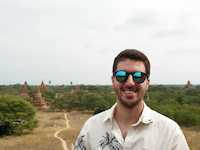

Portuguese 🇵🇹 software engineer born in the 90's. Since earlier developed a great team spirit and communication skills through an education profoundly based on team sports.
In 2012 got the first taste of programming by writing a fine speeding calculator in <a href="https://en.wikipedia.org/wiki/Pascal_(programming_language)" target="_blank" title="Pascal is an imperative and procedural programming language">Pascal</a>.
The first hello world influenced him and played a big role in his decision to embark on a learning journey at <a href="https://www.uminho.pt/EN" target="_blank" title="Official website of University of Minho, Braga, Portugal">University of Minho</a> where he was taught the ways of computer engineering until late 2017.

Within his short career in the tech industry, Daniel has already worked across two different countries. He started at <a href="https://www.flutter.com/" target="_blank" title="Wikipedia page of Flutter Entertainment">Paddy Power Betfair <small>(now Flutter Entertainment plc)</small></a> in the gorgeous city of <a href="https://en.wikipedia.org/wiki/Porto" target="_blank" title="Wikipedia page for Porto, city in Portugal">Porto <small>(Portugal)</small></a> 🇵🇹. Later on, he moved to <a href="https://en.wikipedia.org/wiki/D%C3%BCsseldorf" target="_blank" title="Wikipedia page for, Dusseldorf, city in Germany">Düsseldorf <small>(Germany)</small></a> 🇩🇪, to work as a Frontend JavaScript Engineer at <a href="https://www.trivago.com/" target="_blank" title="Find your ideal hotel and compare prices from different websites">trivago</a>, where he collaborated with a fantastic team trying to take the product to the next level.
Today you can find him in the offices of <a href="https://www.zendesk.com/" target="_blank" title="The best customer experiences are built with Zendesk">Zendesk</a> in <a href="https://en.wikipedia.org/wiki/Singapore" target="_blank" title="Singapore, officially the Republic of Singapore, is a sovereign island city-state in Southeast Asia">Singapore</a> 🇸🇬 where he's facing a different challenge as a Software Engineer emerged in a completely different culture to the ones he has been used to.

Daniel is author of Open Source projects such as <a href="https://github.com/danielcaldas/react-d3-graph" target="_blank" title="Interactive and configurable graphs with react and d3 effortlessly">react-d3-graph</a> and <a href="https://github.com/danielcaldas/react-d3-graph" target="_blank" title="Compile cloudinary URLs at build time.">babel-plugin-cloudinary</a>. He learned a lot contributing to Open Source. He enjoys collaborating with nice and smart strangers around the world to solve problems, enhancing the world wide web a little bit every day.

During his free time - as a side effect of being Portuguese - Daniel tries to cook codfish in several different ways. So far, his tastiest achievement is "<a href="https://lifestyle.sapo.pt/sabores/receitas/pataniscas-de-bacalhau-4" target="_blank" title="Portuguese recipe of codfish cakes"><i>Pataniscas de Bacalhau</i></a>".
