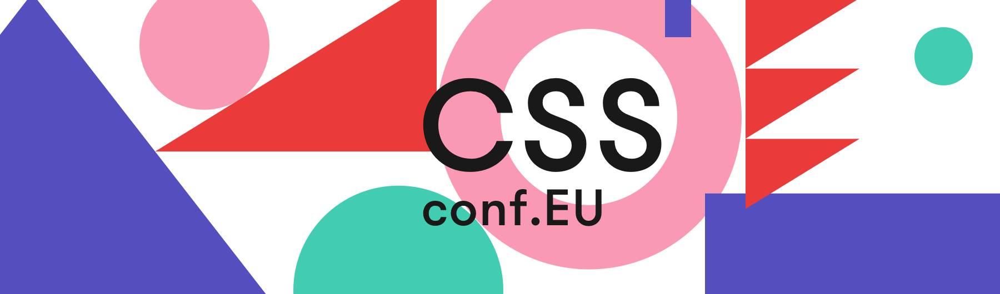
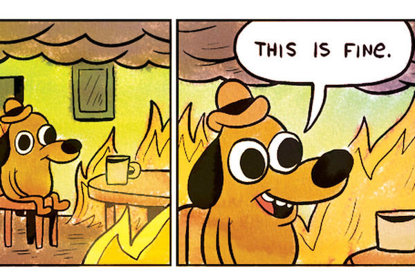
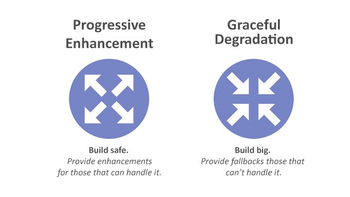
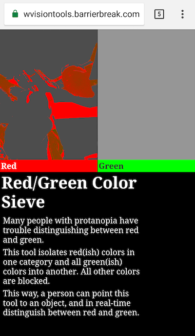
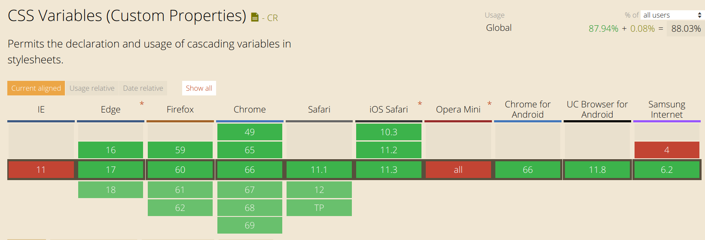
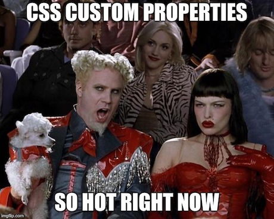

import GIF from "../components/GIF";
import ScrollToTopButton from "../components/ScrollToTopButton";
import Accordion from "../components/Accordion";
import Caption from "../components/Caption";

<ScrollToTopButton />



<Caption source="https://2018.cssconf.eu/" />

Hello all!! I decided to write this blog post to share with you the new things I learned attending this year's edition of <a href="https://2018.cssconf.eu" target="_blank" title="cssconf.eu official web page">CSSconf EU</a> in Berlin (Friday, June 1st). In this post I will focus more on the talks, I will cover other venue details in <a href="https://goodguydaniel.com/blog/about-js-conf-eu-berlin-2018/" target="_blank" title="JSconf EU 2018 | Blog">another blog post</a> on <a href="https://goodguydaniel.com/blog/about-js-conf-eu-berlin-2018/" target="_blank" title="JSconf EU 2018 | Blog">JSConf EU</a> that had a similar organization.

### For starters

If you were there as I was, you were probably wondering whether you were at the right conference, since at the beginning you would ask yourself **where is the CSS**?

<GIF name="travolta" alt="john travolta lost gif" playing={true} />
<Caption source="https://giphy.com/gifs/original-hEc4k5pN17GZq" gif={true} />

But don't give up already! It started poorly on the CSS field, but it evolved throughout the day with some top-notch talks, some of them include Razvan Caliman on _We have DevTools. What about DesignTools?_ and Mike Riethmuller with _Strategy Guide for CSS Custom Properties_.

### The talks

<!-- Preprocessors, Components, and CSS in JS or: How I Learned to Stop Worrying and Love the Website -->
<!-- It’s Dangerous To Go Alone! Take This Team -->

As I mentioned earlier the first talk wasn't so much into CSS, what Trent [(1)](#list-of-talks-speakers-and-other-resources) gave to us was more of a carrier advice on how we should behave as individuals so that we are seen as part of a team, for Trent going solo in some project should never even be considered, we should always ask for feedback if we want to achieve accurate and quality results. Trent shared some personal techniques that help him grow as a developer in a controlled way avoiding things such as _burnout_. The term _mindfulness_ came along somewhere in the talk as Trent was trying to explain the audience how he's able to keep a balanced mental health. Next we had Jackie Balzer [(2)](#list-of-talks-speakers-and-other-resources) who told us a bit of the history behind <a title="Behance is a network of sites and services specializing in self-promotion" href="https://www.behance.net/" target="_blank">Behance’s</a> codebase, how major redesigns left _Jurassic_ footprints in the codebase, some of them in the form of very descriptive "_TODOs_", that today would probably require a herculean effort to remove. At the end Jackie just commented on how she was able to achieve peace with the reality of a fragmented codebase.



<Caption source="https://twitter.com/GOP/status/757687865471963137" />

<!-- The Web Is Not Just Left-to-Right -->

The next talk was truly eye-opening. Chen Hui Jing [(3)](#list-of-talks-speakers-and-other-resources) made a very cool historical overview on typography and writing systems, how some Asian language (such as Chinese, Japanese and Korean) are written vertically, and how that was transported into the web. Designing various labeled pencils in CSS, Chen explained how we could take advantage of <a href="https://developer.mozilla.org/en-US/docs/Learn/CSS/CSS_layout/Flexbox" target="_blank" title="mdn css flexbox">flexbox</a> and <a href="https://developer.mozilla.org/en-US/docs/Web/CSS/grid" target="_blank" title="mdn css grid">grid</a> to manipulate the way we display elements in our web pages. In the end Chen showed some cool examples of how some small tweaks to our web pages could be more interesting displaying some text vertically.

<!-- Refactoring with CSS Grid -->

Following we had Ollie Williams [(4)](#list-of-talks-sp eakers-and-other-resources) who shared the experience of using <a href="https://developer.mozilla.org/en-US/docs/Web/CSS/grid" target="_blank" title="mdn css grid">grid</a> in production. For the first time I had the opportunity to see some real life examples on <a href="https://developer.mozilla.org/en-US/docs/Glossary/Graceful_degradation" target="_blank" title="graceful degradation mdn description">graceful degradation</a> and <a href="https://developer.mozilla.org/en-US/docs/Glossary/Progressive_Enhancement" target="_blank" title="progressive enhancement description">progressive enhancement</a>, if you're wondering what's the difference between this two terms as I was, think of it the following way, <a href="https://developer.mozilla.org/en-US/docs/Glossary/Graceful_degradation" target="_blank" title="graceful degradation mdn description">graceful degradation</a> it's where you worry about providing the best experience possible, you use the latest bleeding edge web technologies to achieve that, for older browsers you will _degrade_ user experience but always assuring some base line level of functionality. On the other hand, <a href="https://developer.mozilla.org/en-US/docs/Glossary/Progressive_Enhancement" target="_blank" title="progressive enhancement description">progressive enhancement</a> philosophy aims to provide the best possible experience in all browsers keeping the same levels of user experience, one will where possible use newest features to _progressively_ improve the user experience.



<Caption source="https://www.youtube.com/watch?v=tmQuGgtq5SI" />

<!-- We have DevTools. What about DesignTools? -->

Razvan Caliman's was one of the top talks [(5)](#list-of-talks-speakers-and-other-resources). The point of this talk was all about how advanced tooling we have nowadays in browsers for developers to debug and analyze applications, but on the other hand how designer tools were _left behind_? Razvan made a pretty good point by exposing the problem this way, in fact he presented a few pains of the design part of the web from a developer perspective, these include editing styles on the fly using the element inspector, modifying <a href="https://developer.mozilla.org/en-US/docs/Web/CSS/CSS_Shapes" target="_blank" title="css shapes mdn">css shapes</a>.

Here you have the list of tools that Razvan mentioned in his talk:

- <a
    href="https://webflow.com/"
    target="_blank"
    title="webflow official website"
  >
    Webflow
  </a> - build responsive sites visually.
- <a
    href="https://developers.google.com/web/updates/2018/01/devtools#overrides"
    target="_blank"
    title="developer chrome local overrides"
  >
    Chrome local overrides
  </a> - make changes in DevTools, and keep those changes across page loads.
- <a
    href="https://chrome.google.com/webstore/detail/finch-developer-tools/phgdjnidddpccdkbedmfifceiljljgdo?hl=en"
    target="_blank"
    title="Finch chrome extension"
  >
    Finch developer tools
  </a> 🌟 - changes you make in the CSS code styles will be saved locally on your
  computer.
- <a
    href="https://youtu.be/2gAW0pUOBRI"
    target="_blank"
    title="chrome color picker"
  >
    Chrome color picker
  </a> - double click on some color in DevTools to open it.
- <a
    href="https://youtu.be/9z7P4Xqr2dU"
    target="_blank"
    title="video chrome text shadow editor"
  >
    Chrome text shadow editor
  </a> - place your mouse on the bottom right corner of some CSS block style on the
  DevTools.
- <a
    href="https://developer.mozilla.org/en-US/docs/Tools/Page_Inspector/How_to/Examine_grid_layouts"
    target="_blank"
    title="firefox grid inspector"
  >
    Firefox CSS grid inspector
  </a>
- <a
    href="https://developer.mozilla.org/en-US/docs/Tools/Page_Inspector/How_to/Edit_CSS_filters"
    target="_blank"
    title="firefox filter editor"
  >
    Firefox CSS filter editor
  </a>
- <a
    href="http://razvan.is/speaking/cssconfeu-2018/#/26"
    target="_blank"
    title="safari css gradient editor"
  >
    Safari CSS gradient editor
  </a>
- <a
    href="https://developer.mozilla.org/en-US/docs/Tools/Page_Inspector/How_to/View_fonts"
    target="_blank"
    title="firefox font editor"
  >
    Firefox font editor
  </a>
- <a
    href="https://developer.mozilla.org/en-US/docs/Tools/Page_Inspector/How_to/Edit_CSS_shapes"
    target="_blank"
    title="firefox shape path editor"
  >
    Firefox shape path editor
  </a>

The talk ended with a kind of "_cry for help_" request, Razvan mentioned that not so many developers were focused on building design dev tools to improve development experience, he encouraged the community to make more designer tools to make us more effective and productive on designing beautiful web apps.

<!--Augmenting Empathy: Simulating Low-Vision Conditions with CSS, SVG and WebRTC-->

From this talk onwards things start focusing a lot around the **accessibility** topic, Shwetank Dixit shows some of his projects on this matter [(6)](#list-of-talks-speakers-and-other-resources).
When we hear “low vision” what do we think about? Well, Shwetank explained that these days low-vision it's just an umbrella term that aggregates a bunch of eyesight conditions that affect people in many different ways. Shwetank made very clear that not conditioned people don't know the real extent of these problems unless we talk with someone who experiences them every day. Following, Shwetank just drop this one "_What if we could make tools to make people see what people with low vision actually see?_" And that was exactly what he did, with CSS, SVG and <a href="https://webrtc.org/" target="_blank" title="what is webrtc">WebRTC</a> he was able to emulate different low vision conditions that were perceptible through a camera (with AR), this is a really noble thing to do, it certainly will make people more aware and comprehensive of this problems, specially those not affected by these problems, at the same time I guess it makes conditioned people less frustrated because I imagine it can be pretty hard to explain one's condition to another, so why not showing it instead? You can consult a list of low vision tools in <a href="https://lowvisiontools.barrierbreak.com/" target="_blank" title="barrierbreak low vision tools">lowvisiontools.barrierbreak.com</a>.



<Caption text="Some guy with a black shirt and red stripes" />

<!--Strategy Guide for CSS Custom Properties-->

Next, we jump into CSS Custom Properties (_aka_ CSS variables)! In this talk [(7)](#list-of-talks-speakers-and-other-resources) we got a close look onto CSS custom properties, they are basically a very nice way to help in the journey of **decoupling logic from design**. The main difference between CSS custom properties and variables
that you might be using with some CSS preprocessor is that those variables are static, using CSS custom properties they can be dynamic
and updated via javascript or for instance within a media query. Another nice detail about custom properties is that they can be scoped, so you can have local (by default they are locally scoped) or global CSS custom properties.

Here a small example to get you started, let's use CSS custom properties to dynamically change the color of shapes.

<GIF
  name="css-variables-demo"
  alt="using CSS custom properties to color geometric shapes"
/>
<Caption gif={true} />

```html
<h2 id="title">
  Familiy of green shapes
</h2>
<button onclick="update('red')">
  red
</button>
<button onclick="update('green')">
  green
</button>
<div class="shape square" />
<div class="shape circle" />
```

```css
:root {
  --shape-color: green;
}

.shape {
  background: var(--shape-color);
}

.square {
  height: 50px;
  width: 50px;
}

.circle {
  margin-left: 100px;
  height: 50px;
  width: 50px;
  border-radius: 50px;
}
```

```javascript
function update(color) {
  const element = document.getElementsByClassName("shape")[0];

  element.style.getPropertyValue("--shape-color");
  getComputedStyle(element).getPropertyValue("--shape-color");
  element.style.setProperty("--shape-color", color);

  document.getElementById("title").innerText = `Family of ${color} shapes`;
}
```

Mike shared his experience with custom properties and gave us some **lessons to use them efficiently**, here they are:

> 1. **All global variables should be static**.
2. **Don't be too cleaver**.
3. **Change the value, not the variable**.
4. **If it changes, it's a variable**.
5. **Separate logic from design, be aware of the _logic fold_**.
6. **Theming will become much easier to achieve**.
7. **Capitalize global static properties**.
8. **Use custom properties now**.

Check out <a href="https://www.youtube.com/watch?v=pF0pSwbZV9Y" target="_blank" title="mike riethmuller about css custom properties">Mike's talk</a> if you want to have a close look at the above 8 lessons.

Is also relevant to mention that CSS variables are today implemented in all the major browsers (excluding IE of course).



<Caption source={"https://caniuse.com/#feat=css-variables"} />

<!--Accessible by Law! Generating Colors with JS and CSS Custom Properties-->

Following, we saw a mix of <a href="https://www.w3.org/standards/webdesign/accessibility" target="_blank" title="w3 accessibility standards">accessibility</a> and CSS custom properties [(8)](#list-of-talks-speakers-and-other-resources), here we learned how to dynamically make our site accessible through CSS custom properties and javascript. In Norway accessibility in websites is <a href="https://www.w3.org/WAI/policies/norway" target="_blank" title="wai policies norway">required by law</a> and as part of this topic your website colors need to provide an accessible experience in ways that everything is legible and by some design miscalculation, you don't get a kind of "_white text on white background_" situation. In this medium blog post <a href="https://medium.com/confrere/automatically-creating-an-accessible-color-palette-from-any-color-sure-e735c3f2f45e" target="_blank" title="medium color palette with css custom properties">_Automatically creating an accessible color palette from any color? Sure!_</a> a colleague of Dag-Inge explains the process on how they generate colors in an accessible way.

<!--The Algorithms of CSS-->

Next talk won the _enthusiastic award_ [(9)](#list-of-talks-speakers-and-other-resources), Lara Schenck on _The Algorithms of CSS_. The story is simple, first Lara question herself why
CSS it's not considered a programming language, and then she dove into the CSS implementation to find how these more high level CSS mechanisms that designers and front end developers use every day are under the hood, this gave her a more clear overview on how CSS works in general. It was an interesting perspective that Lara shared with us but **CSS is not a programming language!** CSS is a **DSL** (Domain Specific Language) to describe styles if you're not familiar with the DSL concept check out this <a href="https://www.martinfowler.com/bliki/DomainSpecificLanguage.html" target="_blank" title="martin fowler dsl">short description by Martin Fowler</a>.

<!-- Container Queries: The Past, Future, and How You Can Actually Even Use Them Today -->

Following with Philip Walton who gave us a look into the future of CSS introducing <a href="https://wicg.github.io/container-queries/" target="_blank" title="container queries specification">container queries</a> [(10)](#list-of-talks-speakers-and-other-resources). Hmm... what are container queries? According to the <a href="https://wicg.github.io/container-queries/" target="_blank" title="container queries specification">specification</a> container queries could be almost seen as a more granular kind of media queries, because they offer similar functionality but instead of allowing you to control style targeting all the viewport they allow you to control style based on the size of a containing element. If you want to have a close look at container queries I recommend you take a look at this <a href="https://philipwalton.com/articles/responsive-components-a-solution-to-the-container-queries-problem/" target="_blank" title="philip walton container queries">article</a> that Philip himself published on container queries.

<!--Design Systems as Facilitators-->

The last talk [(11)](#list-of-talks-speakers-and-other-resources) was about design systems and how they should make the software development process easier by serving as a mean of communication (yes, a facilitator). A design system is a collection of components (ideally reusable) that follow the same standards and that by assembling them you can build applications. In this talk, Claudina Sarahe just went around this topic on how advantageous design systems are but if you really are interested in design systems I really recommend you to take a look at this <a href="https://www.invisionapp.com/inside-design/guide-to-design-systems/" target="_blank" title="invisionapp the guide to design systems">invisionapp blog post instead</a>.

### Hot topics

- <a
    href="https://developer.mozilla.org/en-US/docs/Web/CSS/Using_CSS_variables"
    target="_blank"
    title="mdn css variables"
  >
    CSS custom properties (variables)
  </a>
- <a
    href="https://www.w3.org/WAI/standards-guidelines/wcag/"
    target="_blank"
    title="accessability guidelines"
  >
    Accessability (Web Content Accessibility Guidelines (WCAG))
  </a>
- <a
    href="https://developer.mozilla.org/en-US/docs/Web/CSS/@supports"
    target="_blank"
    title="feature queries mdn"
  >
    Feature queries (&#64;supports)
  </a>
- <a
    href="https://wicg.github.io/container-queries/"
    target="_blank"
    title="container queries specification"
  >
    Container queries
  </a>



<Caption source="https://imgflip.com/memegenerator/Mugatu-So-Hot-Right-Now" />

### List of talks, speakers and other resources

Here the list of the talks with links to videos (at this point the majority of the talks are not available, so I'll link to other talks of the same speakers on the same topic), author twitter and or github as well if available. Note that I marked with a star the talks that I consider to be a must see, people always ask for that. The list has the same order as the <a href="https://2018.cssconf.eu/schedule/" target="_blank" title="css conf.eu 2018 schedule">conference schedule</a>.

<!-- 1. **Trent Willis** <sub><sup>twitter:<a href="https://github.com/trentmwillis" target="_blank" title="tren willis twitter">trentmwillis</a> github:<a href="https://github.com/trentmwillis" target="_blank" title="tren willis github">trentmwillis</a></sup></sub> - _It's Dangerous To Go Alone! Take This Team_ - <a href="https://www.youtube.com/watch?v=2aPjsb-kIks" target="_blank" title="CSSconf EU 2018 | Trent Willis: It’s Dangerous To Go Alone! Take This Team">video</a>
2. **Jackie Balzer** <sub><sup>twitter:<a href="https://twitter.com/jackiebackwards" target="_blank" title="jackie twitter">&#64;jackiebackwards</a> github:<a href="https://github.com/jackie" target="_blank" title="jackie github">jackie</a></sup></sub> - _Preprocessors, Components, and CSS in JS or: How I Learned to Stop Worrying and Love the Website_ - <a href="https://www.youtube.com/watch?v=vLBBq6oizEI" target="_blank" title="CSSconf EU 2018 | Jackie Balzer: Preprocessors, Components, and CSS in JS">video</a>
3. **Chen Hui Jing** <sub><sup>twitter:<a href="https://twitter.com/hj_chen" target="_blank" title="huijing twitter">&#64;hj_chen</a> github:<a href="https://github.com/huijing" target="_blank" title="huijing github">huijing</a></sup></sub> - _The Web Is Not Just Left-to-Right_ - <a href="https://www.chenhuijing.com/slides/32-cssconf-2018/#/" target="_blank" title="the web is not just left-to-right slides">slides</a> | <a href="https://www.youtube.com/watch?v=YpqKrVcth34" target="_blank" title="CSSconf EU 2018 Chen Hui Jing The Web Is Not Just Left-to-Right">video</a> -->

### And then...

I will also write <a href="https://goodguydaniel.com/blog/about-js-conf-eu-berlin-2018/" target="_blank" title="JSconf EU 2018 blogpost">a blog post about the JSConf</a> that happened in the following two days where I'll also talk about Berlin and the venue to give you a real insider perspective on the conference so that you can properly decide whether or not you will attend it next year.
