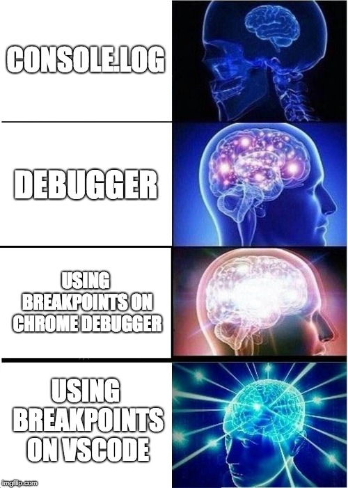
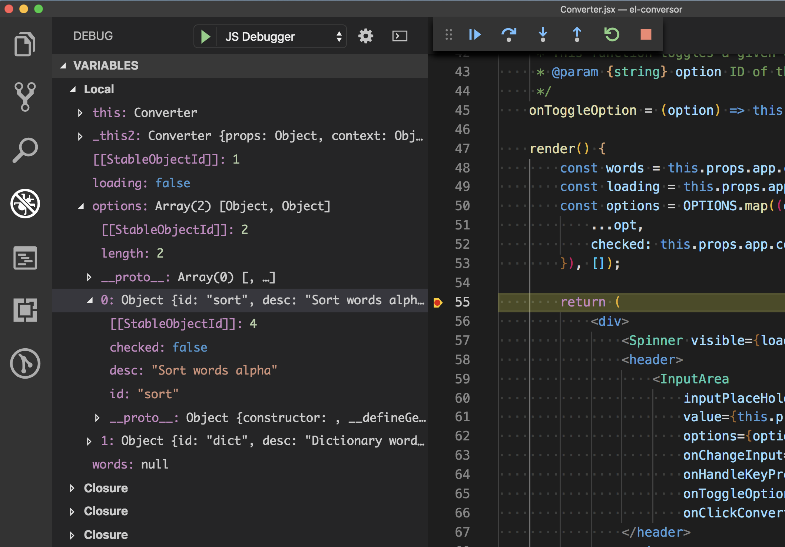
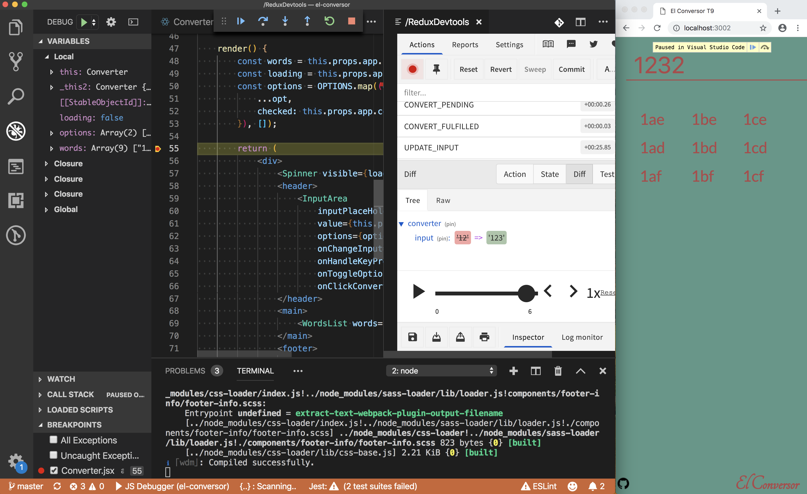

import Caption from "../components/Caption";
import GIF from "../components/GIF";
import ScrollToTopButton from "../components/ScrollToTopButton";

<ScrollToTopButton />

Prepare to set up some rocket science debugging toolkit in <a href="https://code.visualstudio.com/" target="_blank" title="visual studio code is a lightweight but powerful source code editor which runs on your desktop">VS Code</a> for Javascript. After this, you can start kicking ass and showing off your debugging skills to your peers.

<GIF name="vscode-debug-1" alt="vscode debugging animation" />
<Caption gif={true} />

To be precise and not only provide generic instructions on how to setup debugging in VS Code I will provide a step by step guide based on a real open source project so that you can checkout the config and how all the pieces come together. Without further ado I present to you <a href="https://github.com/danielcaldas/el-conversor" target="_blank" title="a number to word list converter as a node backend and react/redux fronted">el-conversor</a>. The project uses <a href="https://www.ecma-international.org/publications/standards/Ecma-262.htm" target="_blank" title="standard ecma-262">ES6</a>, and the build tool is <a href="https://webpack.js.org/" target="_blank" title="bundle your scripts">webpack</a>, this is important to mention because because if you're using <a href="https://www.ecma-international.org/publications/standards/Ecma-262.htm" target="_blank" title="standard ecma-262">ES6</a> you will need to properly configure <a href="https://developer.mozilla.org/en-US/docs/Tools/Debugger/How_to/Use_a_source_map" target="_blank" title="Use a source map - Firefox Developer Tools | MDN">_source maps_</a>. At the end of the [how to guide section](#how-to) you should have this amazing development setup.



<Caption source="https://imgflip.com/memegenerator/Expanding-Brain" />

### How to

Next we will dive deep into <a href="https://github.com/danielcaldas/el-conversor/pull/14" target="_blank" title="feature/setup vscode debugging">this pull request</a> and go step by step on how to set up the perfect debugging environment.

#### Javascript debugger

1. Install <a href="https://marketplace.visualstudio.com/items?itemName=msjsdiag.debugger-for-chrome" target="_blank" title="debug your javascript code in the Chrome browser, or any other target that supports the chrome debugger protocol">Debugger for Chrome</a>.
2. On your root folder create a `.vscode` folder (it may already exist, in that case, jump this step).
3. Create a `launch.json` file inside the `.vscode` directory with the following configuration or click on the gear icon in the debug tab on vscode:

```json:title=.vscode/launch.json
{
  "version": "0.2.0",
  "configurations": [
    {
      "type": "chrome",
      "request": "launch",
      "name": "JS Debugger",
      "userDataDir": true,
      "url": "http://localhost:3002/",
      "webRoot": "${workspaceFolder}",
      "sourceMapPathOverrides": {
        "webpack:///*": "${webRoot}/*"
      }
    }
  ]
}
```

<small>
  You can read more about <i>sourceMapPathOverrides</i> property in the official{" "}
  <a
    href="https://github.com/Microsoft/vscode-chrome-debug/blob/master/README.md#sourcemaps"
    target="_blank"
    title="microsoft/vscode-chrome-debug README.md"
  >
    the README.md of microsoft/vscode-chrome-debug
  </a>
</small>

4. The only thing that you would need to eventually fine tune is the url parameter in order to point to your local dev server.

Now running your development server and simultaneously activating the vscode javascript debugger you're finally able to debug your code!



<Caption />

<br />

#### Redux DevTools

> ⚠️ Although this setup is handy it adds considerable overhead to your development setup. Maybe in the future, better integrations (maybe natively integrated with the IDE) will be available, or maybe there's already some better integration that I might not be aware of, please comment this page if that's the case.

If you're using <a href="https://redux.js.org/" target="_blank" title="a predictable state container for javascript apps">Redux</a> there is a strong possibility that you're debugging your application state with <a href="https://marketplace.visualstudio.com/items?itemName=jingkaizhao.vscode-redux-devtools" target="_blank" title="vscode redux devtools wrapper">Redux DevTools</a>. Wouldn't it be nice to run the Redux DevTools on a VS Code tab, along side with your shinny new debugger? 😎

To bring all this convenience into your favorite IDE, you need to perform the following steps.

1. Install <a href="https://marketplace.visualstudio.com/items?itemName=jingkaizhao.vscode-redux-devtools" target="_blank" title="visual studio code extension to include remotedev-app into editor">Redux DevTools extension</a> for VS Code.
2. Create a remote devserver to broadcast actions to the VS Code extension. For this you need to:
   - Install as a dev dependency <a href="https://www.npmjs.com/package/remotedev-server" target="_blank" title="bridge for communicating with an application remotely via redux devtools extension, remote redux devtools or remotedev">remotedev-server</a>.
   - Create a js script with the following snippet:
   ```javascript
   // remotedev-server.js
   const remotedev = require("remotedev-server");
   remotedev({ hostname: "127.0.0.1", port: 1024 });
   ```
3. Now considering you are already running your local dev server, run the above snippet with `node remotedev-server.js`(this will launch the remote dev server and you should keep it running in some terminal in order to continuously broadcast actions for the extension).
4. Open the extension Redux DevTools (it should open a tab with the empty devtools).
5. Go to settings.
6. Select use local (custom) server and set the **hostname** and **port** to the same values that you defined on the script of step 2.b. (default being `127.0.0.1` and `1024`).
7. Integrate the <a href="https://github.com/zalmoxisus/remote-redux-devtools" target="_blank" title="redux devtools remotely">remote-redux-devtools</a> in you project:

   ```javascript
   // el-conversor/app/common/store.js
   import { createStore, applyMiddleware } from "redux";
   import { createLogger } from "redux-logger";
   import promise from "redux-promise-middleware";
   import { composeWithDevTools } from "remote-redux-devtools";

   import reducer from "./reducers";

   const ENV = window.ENV;

   const middleware =
     ENV.NAME === "production"
       ? applyMiddleware(promise())
       : applyMiddleware(promise(), createLogger());

   const composeEnhancers = composeWithDevTools({
     realtime: true,
     name: "store",
     host: "localhost",
     port: 1024,
   });

   export default createStore(reducer, {}, composeEnhancers(middleware));
   ```

8. Launch the VS Code debugger.
9. Go back to the Redux DevTools and click the connect button.
10. You're good to go! If everything went as expected you should have a similar setup to the one below.



<Caption />

### Conclusions

<br />

<GIF name="vscode-debug-2" alt="vscode debugging animation redux" />
<Caption gif={true} />

I might have spent one or two days trying to figure out how to bring all these pieces together, but having done it, believe that it increased my productivity in ways that by far compensate the invested time. I hope you find this article useful especially if it saves you one day of trouble trying to figure out the right configs.
