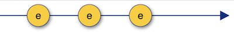
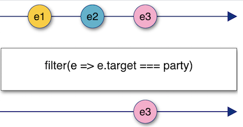
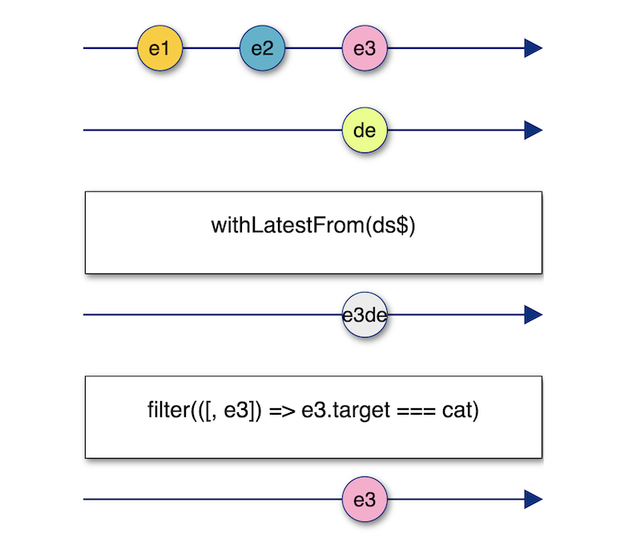

import Accordion from "../components/Accordion";
import Caption from "../components/Caption";
import GIF from "../components/GIF";
import ScrollToTopButton from "../components/ScrollToTopButton";

<ScrollToTopButton />

- <a
    href="https://goodguydaniel.com/blog/why-reactive-programming"
    target="_blank"
    title="Why You Should Consider Reactive Programming | goodguydaniel.com"
  >
    Part 1 - Why You Should Consider Reactive Programming
  </a>
- <a
    href="https://goodguydaniel.com/blog/reactive-programming-fundamentals"
    target="_blank"
    title="Fundamentals of Reactive Programming | goodguydaniel.com"
  >
    Part 2 - Fundamentals of Reactive Programming
  </a>
- **Part 3 - Hands-on Reactive Programming with RxJS**
- 🔜 Part 4 - Reactive Programming: The Good and the Bad
- 🔜 Part 5 - List of Awesome RxJS and Reactive Programming Resources

---

<a href="" target="_blank" title=""></a>
<a href="" target="_blank" title=""></a>

This part of the series it's all about getting your hands dirty! We're going to start with a small refresher from <a href="https://goodguydaniel.com/blog/reactive-programming-fundamentals" target="_blank" title="Fundamentals of Reactive Programming | goodguydaniel.com">the previous article</a>, we're going to start with a quick refresher of two concepts we've explored **streams** and **operators** by implementing a click event handlers with <a href="https://rxjs-dev.firebaseapp.com/" target="_blank" title="A reactive programming library for JavaScript">RxJS</a>. Next, we'll have a brief overview of RxJS, followed by the main challenge of building a small animated game that teach us how to approach building something the reactive way.

- `TODO: add links to this`
- Warmup - Handle a click event with RxJS
- RxJS overview
- Let's build something!
  - Take the cat to the party
  - Level 1 - Combining streams of DOM events
  - Level 2 - Hacking race conditions
  - Level 3 - Merging streams into one stream
  - Level 4 - Flatten Observables & Cancellation
- Closing Notes

#### Warmup - Handle a click event with RxJS

Here's how a usual JavaScript event handler function looks like.

```html
<button id="btn">+1</button>
```

```javascript
const btn = document.getElementById("btn");
let counter = 0;
btn.addEventListener("click", (event) => {
  counter++;
  console.log(`Incremented ${counter}`);
});
```

In the above code, we're merely incrementing `counter` that is global and logging its value each time we update it.

Usually, we don't increment globals or `console.log` directly in real-life apps, but we do have other side-effects in place (like updating something else in the UI, triggering a web request, firing an animation, etc.). With this approach, we're pretty much stuck with the event handler. You can always organize your code to split concerns, but it seems the event handler is already doing two very distinct things, and we're barely getting started.

Here's how you should visualize a stream of click events.

<!-- NOTE: For better screen size fitting all marble diagrams shall have 400px -->



<Caption
  text={() => (
    <p>
      <b>e</b> stands for <b>event</b> and its the value that is pushed to the stream at each click, just like you would
      have a payload <b>event</b> in the typical <b>onClick</b> callback
    </p>
  )}
/>

<br />
<br />

Let's take a look at how this looks like in the reactive world, with RxJS.

```javascript
let counter = 0;
const click$ = fromEvent(btn, "click");
click$.subscribe(() => {
  counter++;
  console.log(`Incremented ${counter}`);
});
```

A few things to notice here:

- <a
    href="https://www.learnrxjs.io/learn-rxjs/operators/creation/fromevent"
    target="_blank"
    title="fromEvent - Learn RxJS"
  >
    fromEvent
  </a> is the tool in RxJS that will allow you to transform any DOM event into an Observable, a stream of events of a given
  type (e.g., click).
- `subscribe` well, without subscribing to our stream, would just be dead code. The code path that we're setting up inside our `pipe` will never be visited if you don't subscribe to it, since no values are emitted.
- The `$` is just a common (non-standard) notation to identify streams in your code - totally optionally, no need to follow - if you're curious, you can read more about it <a href="https://medium.com/@benlesh/observables-and-finnish-notation-df8356ed1c9b" target="_blank" title="Observables and Finnish Notation. Once in a while I’m asked what I think… | by Ben Lesh | Medium">Observables and Finnish Notation</a>.

A cool thing here is that opposite to the click event handler, you can subscribe to the stream of clicks as many times as you want and split all kinds of different tasks into separate subscriptions; in a way, things are opening up for you, you get a more flexible model to organize your code. Compared to an event handler callback, you now have the power to subscribe to the `click$` stream as many times as you want. You can even split whatever logic you need to perform into different subscriptions! How about that? There's a lot more flexible compared to the classic callback.

**Anything can be a stream, remember that**. This should get you warmed up for the real challenge later in the article. Before that, let's take a look at how the overall structure of RxJS looks like.

#### RxJS overview

I would highly recommend you later to go through the <a href="https://rxjs-dev.firebaseapp.com/guide/overviewhttps://rxjs-dev.firebaseapp.com/guide/overview" target="_blank" title="RxJS - Introduction">RxJS official docs overview</a>; it complements a few concepts I've covered in <a href="https://goodguydaniel.com/blog/reactive-programming-fundamentals" target="_blank" title="Fundamentals of Reactive Programming | goodguydaniel.com">the previous article</a>. But for now, I want to focus on two things only: **creating streams and manipulating them**. Looking at RxJS, you'll see that you can identify two big groups of "things":

- **Stream creators/producers** are tools that will allow you to take anything and make it a stream. In the previous section, for example, we used `fromEvent` to transform DOM click events into an Observable, **a stream that you can subscribe to**.
- **Operators** are instruments that will allow you to not only hook into the stream to perform operations with the data flowing through it but also combine them, as we'll see later on.

#### Let's build something!

Now we've had our refresher, we can jump into building a small animated game with RxJS, something more complex.

##### Take the cat to the party

The game we're building is called **"Take the cat to the party"**, here's how it goes down.

<GIF name="take-cat-to-party" alt="take the cat to the party game demonstration" playing={false} />
<Caption
  gif={true}
  text={"The game consists in dropping a picture of a cat into a picture of a party with cats, within 5 seconds."}
/>

- There's a cat in a motorbike in your top left corner (draggable HTML element).
- There's a decoy at the bottom left corner (draggable HTML element).
- There's a party at the right bottom corner of the page (our drop zone).
- We need to drop the cat at the party in less than 5 seconds to win. Nothing should happen if the decoy is the dragged element.
- While dragging the cat, there's an animation of the cat driving to the party and a counter appearing at the top right corner.

We're going to split this into **4 levels**. Per each level, I'll explain the goal we're trying to achieve, show you how the implementation looks, and what it does with plenty of detail. Feel free to try and code the levels before checking the solution. You can <a href="https://github.com/danielcaldas/take-the-cat-to-the-party" target="_blank" title="danielcaldas/take-the-cat-to-the-party: Learn reactive programming with RxJS the fun way">check out this repo</a> if you're willing to give it a try. The file <a href="https://github.com/danielcaldas/take-the-cat-to-the-party/blob/master/cat-party-empty.html" target="_blank" title="danielcaldas/take-the-cat-to-the-party: Learn reactive programming with RxJS the fun way template file">cat-party-empty.html</a> contains the necessary boilerplate in a single HTML file. You can just open it in the browser and start coding.

Before we start, let's take a look at some boilerplate code that we have set already.

There are a bunch of RxJS taken from the global `window` at the top (I'm just injecting RxJS as with a `<script>` at the top level), you can just ignore for now. Then we have our markup appended to the element's `app` `innerHTML`. Just some boilerplate, don't bother with the detail.

```html
<head>
  <script src="https://cdnjs.cloudflare.com/ajax/libs/rxjs/6.5.5/rxjs.umd.js"></script>
  <script src="https://cdnjs.cloudflare.com/ajax/libs/rxjs/6.5.5/rxjs.umd.js.map"></script>
</head>
<body>
  <div id="app"></div>
  <script>
    const {
      map,
      // ...
    } = window.rxjs.operators;
    const {
      fromEvent,
      // ,,,
    } = window.rxjs;
    // ...
    document.getElementById("app").innerHTML = `
      <h2>Take the 🐈 to the 🎉</h2>
      <div id="loader" style="display:none;position:absolute;right:0;z-index:-1;">
        
        <span id="countdown" style="top:0;right:0;position:absolute;z-index:9999;font-weight:bold;font-size:46px;">-</span>
      </div>
      <div id="drop-zone" style="position:absolute;right:5px;bottom:5px;width:180px;height:180px;border:2px dashed black;z-index:2;"></div>
      
      </div>
      
      <div id="decoy" draggable="true" style="font-size:28px;position:absolute;left:20px;bottom:10px;text-align:center;cursor:grab;font-weight:bold;">DECOY</div>
    `;
  </script>
</body>
```

The next block contains a few of the DOM elements we'll often be referring to.

```javascript
const cat = document.getElementById("cat");
const party = document.getElementById("drop-zone");
const loading = document.getElementById("loader");
const countdown = document.getElementById("countdown");
```

Finally, we reach the beginning of our first level, introduced by three streams that we'll use quite often while going through the challenge.

```javascript
const ds$ = fromEvent(document, "dragstart");
const de$ = fromEvent(document, "dragend");
const drop$ = fromEvent(document, "drop");
```

<br />
<br />

##### Level 1 - Combining streams of DOM events

- We should be able to take the cat to the party by dragging it.
  - Place the cat inside the party together with other cats.
  - We also want to hide/remove the original cat element when we're dropping the cat at the party.

Let's follow a bottom-up approach. We'll start by building some specific streams to assemble to create more complex behaviors as we move along.

Let's start by answering the following: how do we know an HTML element has been dropped at the `party`? We'll need to detect any `drop` event that occurs in the `party` element.

```javascript
const partyDrop$ = drop$.pipe(filter((event) => event.target === party));
```



<Caption
  text={() => (
    <p>
      <b>e</b> stands for <b>event</b> and its the value that is pushed to the stream at each drop event in the whole
      document! <b>e1</b>, <b>e2</b> and <b>e3</b> are different, they have different <code>event.target</code>.
    </p>
  )}
/>

Cool, we now have a stream that emits a `drop` event every time something is dropped in `party`. Let's see how we can detect that the `cat` is dropped at the `party`.

Let's take a moment to understand the how to visualize `partyDrop$` with the help of the marbles diagram. First a reminder that the bottom timeline is the actual stream. Second notice that `e1` and `e2` marbles don't make it to the bottom timeline, that's because for these events the user did not drop the cat at the `party` element, thus `e.target` being different than our DOM element `party`. Let's move forward.

```javascript
const catAtParty$ = partyDrop$.pipe(
  withLatestFrom(ds$),
  filter(([, ds]) => ds.target === cat)
);
```

Alright, a few things are going on here. We're familiar with <a href="https://www.learnrxjs.io/learn-rxjs/operators/combination/withlatestfrom" target="_blank" title="withLatestFrom - Learn RxJS">withLatestFrom</a>, but this time, it's a bit more complex to perceive. We're looking into a stream of `dragstart` events `ds$` and asking it for the last value (DOM element) emitted in that stream; this is the same as saying that we want the last draggable element in the page that emitted a `dragstart` event! Next, we have `filter`. We're going to use `filter` to narrow down our stream to allow `dragstart` events to pass through only if their target element is `cat`! And that's it! We have a stream that will emit an event every time we drop the cat at the party.



<Caption text={() => <p>TODO: BIGGER MARBLES!!!!!!!!!</p>} />

<!-- ```javascript
function countdown(seconds) {
  let secondsLeft = seconds;
  let intervalId;

  intervalId = setInterval(() => {
    if (secondsLeft === 0) {
      console.log("time's up!");
      clearInterval(intervalId);
    } else {
      console.log(secondsLeft);
      secondsLeft--;
    }
  }, 1000);
}
countdown(5);
```

___

- <a
    href="https://goodguydaniel.com/blog/why-reactive-programming"
    target="_blank"
    title="Why You Should Consider Reactive Programming | goodguydaniel.com"
  >
    Part 1 - Why You Should Consider Reactive Programming
  </a>
- <a
    href="https://goodguydaniel.com/blog/reactive-programming-fundamentals"
    target="_blank"
    title="Fundamentals of Reactive Programming | goodguydaniel.com"
  >
    Part 2 - Fundamentals of Reactive Programming
  </a>
- **Part 3 - Hands-on Reactive Programming with RxJS**
- 🔜 Part 4 - Reactive Programming: The Good and the Bad
- 🔜 Part 5 - List of Awesome RxJS and Reactive Programming Resources -->
