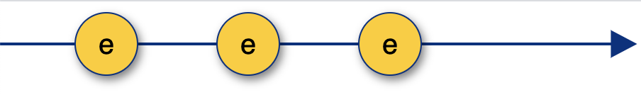

import Accordion from "../components/Accordion";
import Caption from "../components/Caption";
import GIF from "../components/GIF";
import ScrollToTopButton from "../components/ScrollToTopButton";

<ScrollToTopButton />

- <a
    href="https://goodguydaniel.com/blog/why-reactive-programming"
    target="_blank"
    title="Why You Should Consider Reactive Programming | goodguydaniel.com"
  >
    Part 1 - Why You Should Consider Reactive Programming
  </a>
- <a
    href="https://goodguydaniel.com/blog/reactive-programming-fundamentals"
    target="_blank"
    title="Fundamentals of Reactive Programming | goodguydaniel.com"
  >
    Part 2 - Fundamentals of Reactive Programming
  </a>
- **Part 3 - Hands-on Reactive Programming with RxJS**
- 🔜 Part 4 - Reactive Programming: The Good and the Bad
- 🔜 Part 5 - List of Awesome RxJS and Reactive Programming Resources

---

<a href="" target="_blank" title=""></a>
<a href="" target="_blank" title=""></a>

This part of the series it's all about getting your hands dirty! We're going to start with a small refresher from <a href="https://goodguydaniel.com/blog/reactive-programming-fundamentals" target="_blank" title="Fundamentals of Reactive Programming | goodguydaniel.com">the previous article</a>, we're going to start with a quick refresher of two concepts we've explored **streams** and **operators** by implementing a click event handlers with <a href="https://rxjs-dev.firebaseapp.com/" target="_blank" title="A reactive programming library for JavaScript">RxJS</a>. Next, we'll have a brief overview of RxJS, followed by the main challenge of building a small animated game that teach us how to approach building something the reactive way.

#### Handle a click event with RxJS

Here's how a usual JavaScript event handler function looks like.

```html
<button id="btn">+1</button>
```

```javascript
const btn = document.getElementById("btn");
let counter = 0;
btn.addEventListener("click", (event) => {
  counter++;
  console.log(`Incremented ${counter}`);
});
```

In the above code, we're merely incrementing `counter` that is global and logging its value each time we update it.

Usually, we don't increment globals or `console.log` directly in real-life apps, but we do have other side-effects in place (like updating something else in the UI, triggering a web request, firing an animation, etc.). With this approach, we're pretty much stuck with the event handler. You can always organize your code to split concerns, but it seems the event handler is already doing two very distinct things, and we're barely getting started.

Here's how you should visualize a stream of click events.



<Caption
  text={() => (
    <p>
      <b>e</b> stands for <b>event</b> and its the value that is pushed to the stream at each click, just like you would
      have a payload <b>event</b> in the typical <b>onClick</b> callback
    </p>
  )}
/>

<br />
<br />

Let's take a look at how this looks like in the reactive world, with RxJS.

```javascript
let counter = 0;
const click$ = fromEvent(btn, "click");
click$.subscribe(() => {
  counter++;
  console.log(`Incremented ${counter}`);
});
```

A few things to notice here:

<!-- ```javascript
function countdown(seconds) {
  let secondsLeft = seconds;
  let intervalId;

  intervalId = setInterval(() => {
    if (secondsLeft === 0) {
      console.log("time's up!");
      clearInterval(intervalId);
    } else {
      console.log(secondsLeft);
      secondsLeft--;
    }
  }, 1000);
}
countdown(5);
```

___

- <a
    href="https://goodguydaniel.com/blog/why-reactive-programming"
    target="_blank"
    title="Why You Should Consider Reactive Programming | goodguydaniel.com"
  >
    Part 1 - Why You Should Consider Reactive Programming
  </a>
- <a
    href="https://goodguydaniel.com/blog/reactive-programming-fundamentals"
    target="_blank"
    title="Fundamentals of Reactive Programming | goodguydaniel.com"
  >
    Part 2 - Fundamentals of Reactive Programming
  </a>
- **Part 3 - Hands-on Reactive Programming with RxJS**
- 🔜 Part 4 - Reactive Programming: The Good and the Bad
- 🔜 Part 5 - List of Awesome RxJS and Reactive Programming Resources -->
