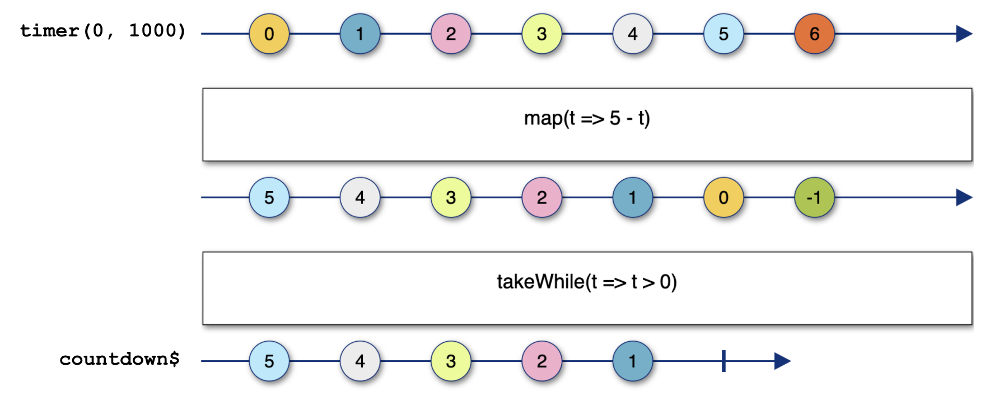

import Accordion from "../components/Accordion";
import Caption from "../components/Caption";
import GIF from "../components/GIF";
import ScrollToTopButton from "../components/ScrollToTopButton";

<ScrollToTopButton />

- <a
    href="https://goodguydaniel.com/blog/why-reactive-programming"
    target="_blank"
    title="Why You Should Consider Reactive Programming | goodguydaniel.com"
  >
    Part 1 - Why You Should Consider Reactive Programming
  </a>
- <a
    href="https://goodguydaniel.com/blog/reactive-programming-fundamentals"
    target="_blank"
    title="Fundamentals of Reactive Programming | goodguydaniel.com"
  >
    Part 2 - Fundamentals of Reactive Programming
  </a>
- **Part 3 - Hands-on Reactive Programming with RxJS**
- 🔜 Part 4 - Reactive Programming: The Good and the Bad
- 🔜 Part 5 - List of Awesome RxJS and Reactive Programming Resources

---

This part of the series it's all about getting your hands dirty! Part 3 is a tutorial on core techniques to build an application with reactive streams using <a href="https://rxjs-dev.firebaseapp.com/" target="_blank" title="A reactive programming library for JavaScript">RxJS</a>.

- [Warmup - Handle a click event with RxJS](#warmup---handle-a-click-event-with-rxjs)
- [RxJS Overview](#rxjs-overview)
- [Let's build something!](#lets-build-something)
- [Level 1 - Combining streams of DOM events](#level-1---combining-streams-of-dom-events)
- [Level 2 - Hacking race conditions with artificial delays](#level-2---hacking-race-conditions-with-artificial-delays)
- [Level 3 - Merging streams into one stream](#level-3---merging-streams-into-one-stream)
  - [Bonus for Level 3](#bonus-for-level-3)
  - [Note about the coding style](#note-about-the-coding-style)
- [Level 4 - Flatten observables, timers and cancellation](#level-4---flatten-observables-timers-and-cancellation)
- [Closing Notes](#closing-notes)

We're going to start with a small refresher from <a href="https://goodguydaniel.com/blog/reactive-programming-fundamentals" target="_blank" title="Fundamentals of Reactive Programming | goodguydaniel.com">the previous article</a>, implementing a click event handler with <a href="https://rxjs-dev.firebaseapp.com/" target="_blank" title="A reactive programming library for JavaScript">RxJS</a>. Next, we'll have a brief overview of RxJS, followed by the main challenge of building a small animated game the reactive way.

#### Warmup - Handle a click event with RxJS

Here's how a usual JavaScript event handler function looks like.

```html
<button id="btn">+1</button>
```

```javascript
const btn = document.getElementById("btn");
let counter = 0;
btn.addEventListener("click", (event) => {
  counter++;
  console.log(counter);
});
```

In the above code, we're incrementing `counter` that is global and logging its value each time we update it.

Usually, we don't increment globals or `console.log` directly in real-life apps, but we do have other side-effects in place (like updating something else in the UI, triggering a web request, firing an animation, etc.). You can always organize your code to split concerns, but it seems the event handler is already doing two very distinct things, and we're barely getting started.

Let's take a look at how this looks like in the reactive world, with RxJS. Here's how you should visualize and implement a stream of click events.


<Caption
  text={() => (
    <p>
      <b>e</b> stands for <b>event</b> and it's the value pushed to the stream at each click in the button element, just
      like you would have an <b>event</b> argument in the typical <b>onClick</b> callback (event handler) at each click.
    </p>
  )}
/>

<br />

```javascript
let counter = 0;
const click$ = fromEvent(btn, "click");
click$.subscribe((event) => {
  counter++;
  console.log(counter);
});
```

A few things to notice here:

- <a href="https://rxjs-dev.firebaseapp.com/api/index/function/fromEvent" target="_blank" title="RxJS - fromEvent">
    fromEvent
  </a> is the tool in RxJS that will allow you to transform any DOM event into an Observable, a stream of events of a given
  type (like click, drag, scroll etc.).
- `subscribe` is a must! Without subscribing to our stream, nothing would ever happen.
- The `$` is just a common (non-standard) notation to identify streams in your code - totally optionally, no need to follow.

A cool thing here is that opposite to the click event handler, you can subscribe to the stream of clicks as many times as you want and split all kinds of different tasks into separate subscriptions that share the same event listener! In a way, things are opening up, you get a more flexible model to organize your code, compared to the classic event handler callback.

> Anything can be a stream, remember that, let it be the cornerstone of your reactive thinking.

This should get you warmed up for the real challenge later in the article. Before that, there's something I want to mention about the RxJS library.

#### RxJS Overview

I would highly recommend you later to go through the <a href="https://rxjs-dev.firebaseapp.com/guide/overviewhttps://rxjs-dev.firebaseapp.com/guide/overview" target="_blank" title="RxJS - Introduction">RxJS official docs overview</a>; it complements a few concepts I've covered in <a href="https://goodguydaniel.com/blog/reactive-programming-fundamentals" target="_blank" title="Fundamentals of Reactive Programming | goodguydaniel.com">the previous article</a> giving you a more mature view into the fundamentals. But for now, I want to focus on two things only: **creating streams and manipulating them**. Looking at RxJS, you'll see that you can identify two big groups of "things":

- **Stream creators/producers** are tools that will allow you to take anything and make it a stream. In the previous section, for example, we used `fromEvent` to transform DOM click events into an Observable, **a stream that you can subscribe to**.
- **Operators** are instruments that will allow you to not only hook into the stream to perform operations with the data flowing through it but also combine them.

#### Let's build something!

Now we've had our refresher, we can jump into building a small animated game with RxJS, something more complex.

The game we're building is called **"Take the cat to the party"**, here's how it goes down.

<GIF name="take-cat-to-party" alt="take the cat to the party game demonstration" playing={false} />
<Caption gif={true} />

- There's a cat in a motorbike in your top left corner (draggable HTML element).
- There's a decoy at the bottom left corner (draggable HTML element).
- There's a party at the right bottom corner of the page (our drop zone).
- **We need to drop the cat at the party in less than 5 seconds to win**. Nothing should happen if the decoy is the dragged element.
- While dragging, there's an animation of the cat driving to the party and a counter appearing at the top right corner.
- Per each attempt, if the cat is dragged for longer than 5 seconds you lose.

We're going to split this into **4 levels**. Per each level, I'll explain the goal we're trying to achieve, show you how the implementation looks like, and what it does with plenty of detail. Feel free to try and code the levels yourself before checking the suggested solution. You can <a href="https://github.com/danielcaldas/take-the-cat-to-the-party" target="_blank" title="danielcaldas/take-the-cat-to-the-party: Learn reactive programming with RxJS the fun way">check out this repo</a> if you're willing to give it a try. The file <a href="https://github.com/danielcaldas/take-the-cat-to-the-party/blob/master/cat-party-empty.html" target="_blank" title="danielcaldas/take-the-cat-to-the-party: Learn reactive programming with RxJS the fun way template file">cat-party-empty.html</a> contains the necessary boilerplate in a single HTML file. You can just open it in the browser and start coding.

Before we start, let's take a look at some boilerplate code already in place.

There are a bunch of RxJS taken from the global `window` at the top (I'm just injecting RxJS via `<script>` at the top of the HTML file). Then we have our markup appended to the element's `app` `innerHTML`. Just some boilerplate, don't bother with the detail.

```html
<head>
  <script src="https://cdnjs.cloudflare.com/ajax/libs/rxjs/6.5.5/rxjs.umd.js"></script>
  <script src="https://cdnjs.cloudflare.com/ajax/libs/rxjs/6.5.5/rxjs.umd.js.map"></script>
</head>
<body>
  <div id="app"></div>
  <script>
    const {
      map,
      // ...
    } = window.rxjs.operators;
    const {
      fromEvent,
      // ...
    } = window.rxjs;
    // ...
    document.getElementById("app").innerHTML = `
      <h2>Take the 🐈 to the 🎉</h2>
      <div id="loader" style="display:none;position:absolute;right:0;z-index:-1;">
        
        <span id="countdown" style="top:0;right:0;position:absolute;z-index:9999;font-weight:bold;font-size:46px;">-</span>
      </div>
      <div id="drop-zone" style="position:absolute;right:5px;bottom:5px;width:180px;height:180px;border:2px dashed black;z-index:2;"></div>
      
      </div>
      
      <div id="decoy" draggable="true" style="font-size:28px;position:absolute;left:20px;bottom:10px;text-align:center;cursor:grab;font-weight:bold;">DECOY</div>
    `;
  </script>
</body>
```

The next block contains a few of the DOM elements we'll often be referring to.

```javascript
const cat = document.getElementById("cat");
const party = document.getElementById("drop-zone");
const loading = document.getElementById("loader");
const countdown = document.getElementById("countdown");
```

Finally, **we introduce three streams that we'll use quite often while going through the challenge. These are the most basic building blocks of our solutions.**

```javascript
const dragstart$ = fromEvent(document, "dragstart");
const dragend$ = fromEvent(document, "dragend");
const drop$ = fromEvent(document, "drop");
```

<br />
<br />

#### Level 1 - Combining streams of DOM events

- We should be able to take the cat to the party by dragging it.
  - Place the cat inside the party together with other cats.
  - We also want to hide the original cat element while dragging it for a better user experience.

Let's follow a bottom-up approach. We'll start by building some specific streams that will allow us to assemble more complex behaviors as we move along.

Let's start by answering the following: how do we know that an HTML element has been dropped at the `party`? We'll need to detect any `drop` event that occurs in the `party` element.

```javascript
const partyDrop$ = drop$.pipe(filter((event) => event.target === party));
```


<Caption
  text={() => (
    <p>
      <b>e</b> stands for <b>event</b> and it's the value pushed to the stream at each drop event in the whole document!{" "}
      <b>e1</b>, <b>e2</b> and <b>e3</b> have different <b>event.target</b> (target DOM elements).
    </p>
  )}
/>

Cool, we now have a stream that emits a `drop` event every time something is dropped in the `party`, we ensure that using the <a href="https://rxjs-dev.firebaseapp.com/api/operators/filter" target="_blank" title="RxJS - filter">filter</a> operator.

I would like to pause and add further detail on this marble diagram. Notice that we read from top to bottom, meaning the last timeline is the only one that really matters, it's the fine grained stream that gives us more useful values. In this case since we won't subscribe to `drop$` directly, think of it as an auxiliary conceptual timeline which is a step towards shaping the ideal stream to tackle our task: `partyDrop$`.

Another relevant detail on the marbles diagram: `e1` and `e2` marbles don't make it to `partyDrop$` (bottom stream). For those events,
`event.target` it's not `party`, this means the user did not drop the HTML element in the `party`.

**At this point we can already notice the exceptional compositional capabilities of streams and how easy it is to plug & play the smaller blocks (such as `drop$`) to build higher level streams.**

Next, let's see how we can detect that the `cat` is dropped at the `party`.

```javascript
const catAtParty$ = partyDrop$.pipe(
  withLatestFrom(dragstart$),
  filter(([dropEvent, dragStartEvent]) => dragStartEvent.target === cat),
);
```

Alright, a few things are going on here. We're familiar with <a href="https://rxjs-dev.firebaseapp.com/api/operators/withLatestFrom" target="_blank" title="RxJS - withLatestFrom">withLatestFrom</a>, but this time, it's a bit more complex to perceive. We're looking into a stream of `dragstart` events `dragstart$` and asking it for the last value emitted in that stream; this is the same as saying that we want the last draggable element in the page that emitted a `dragstart` event! Next, we have `filter` again. We're going to use `filter` to narrow down our stream to allow `dragstart` events to pass through only if their target element is `cat`! And that's it! We have a stream that will emit an event every time we drop the cat at the party.


<Caption />

In the above diagram, `e1`, `e2` and `e3` are `dragstart` events (`dragstart$` stream) that might come from anywhere in the page. `de` represents a `drop` event at the `party`. Notice how `withLatestFrom` operates by bringing together the last element on `dragstart$` which is `e3` and with the `party` element which is published to the `dragend$` stream. Now because `e3` event target is actually the `cat` you'll get `e3` pushed to our final stream `catAtParty$`!

But we're not finished just yet; we need to leverage the work we've constructed so far to actually render the `cat` in the `party`. For that, we just need to subscribe to our `catAtParty$` stream and do some DOM manipulations.

```javascript
catAtParty$.subscribe(([partyDropEvent, dragStartEvent]) => {
  // some console.logs to check what we really get subscribing to catAtParty$
  // console.log({ partyDropEvent, dragStartEvent });
  // console.log({ partyDropEvent: event.type, dragStartEvent: event.type });
  cat.remove();
  party.appendChild(cat);
});
```


<Caption
  text={() => (
    <p>
      The <b>console.log</b> reveals the <b>drop</b> and <b>dragstart</b> events as payload for our subscription. We
      also log the <b>event.type</b> of each individual event.
    </p>
  )}
/>

If you're following this point, you'll notice that although we can drag the cat perfectly, we still see the original `cat` element while carrying it.

<GIF name="game-level-1-opacity-before" alt="dragging the cat without manipulating the opacity value" playing={false} />
<Caption gif={true} text={"We see the original cat element while dragging it."} />

<br />

<GIF name="game-level-1-opacity-after" alt="dragging the cat with opacity manipulation" playing={false} />
<Caption
  gif={true}
  text={() => (
    <p>
      Setting the cat's element opacity to <b>0</b> yields a more natural user experience.
    </p>
  )}
/>

To achieve the same behavior we have in the above GIF, we want to toggle the `cat` element's opacity while dragging. Yes, another side effect, we can actually simply create another subscription to take care of this.

```javascript
const catDragStart$ = dragstart$.pipe(filter((event) => event.target === cat));
const catDragEnd$ = dragend$.pipe(filter((event) => event.target === cat));
catDragStart$.subscribe((event) => {
  cat.style.opacity = 0;
});
catDragEnd$.subscribe((event) => {
  cat.style.opacity = 1;
});
```

And done with Level 1!

I want to leave a challenge for the reader. Looking at how we're setting the opacity value of the `cat` element, could we somehow handle everything in one single subscription instead of two? I would suggest you to read the whole article and come back to this one later, you should be then able to nail it then.

<Accordion summary="Hint">
  Check the operator <b>merge</b>.
</Accordion>

<br />

<Accordion summary='Solution'>

```javascript
const catDragStart$ = dragstart$.pipe(filter((event) => event.target === cat));
const catDragEnd$ = dragend$.pipe(filter((event) => event.target === cat));
const opacity$ = merge(catDragStart$.pipe(mapTo(0)), catDragEnd$.pipe(mapTo(1)));

opacity$.subscribe((value) => {
  cat.style.opacity = value;
});
```

</Accordion>

<br />

#### Level 2 - Hacking race conditions with artificial delays

- We should announce the cats' arrival with a `window.alert` message.
  - Before triggering the `window.alert` we'll want to make sure the `cat` is actually rendered at the `party`.

So we already have a stream that emits an event each time we drag the cat to the party, it's called `catAtParty$`. Our work here is mostly done. We just need to subscribe to it.

```javascript
catAtParty$.subscribe(() => {
  window.alert("Cat is at the party! You win!");
  window.location.reload();
});
```

<br />
<br />

<GIF name="game-level-2-no-cat" alt="demonstration asynchronous rendering cat DOM element" playing={false} />
<Caption
  gif={true}
  text={() => (
    <p>
      <b>window.alert</b> is triggered when we drop the cat at the <b>party</b>, but the <b>cat</b> is not rendered!
    </p>
  )}
/>

Hmm.. strange, we did everything right but the `window.alert` triggers before we get to actually render the `cat` at the `party`, what a bummer.

It seems that the DOM changes don't kick in before we trigger the alert; that's because the rendering is asynchronous, and the page only gets updated later on after we're done with executing this function and dismissing the alert. I don't want to spend much time fixing this since I don't have any mechanism to tell me whether the DOM node has been rendered successfully, I'm going to code a hack and trigger the alert inside a `setTimeout` that should buy us some time to correctly render the `cat` element.

```javascript
catAtParty$.subscribe(() => {
  setTimeout(() => {
    window.alert("Cat is at the party! You win!");
    window.location.reload();
  }, 100);
});
```

<br />
<br />

<GIF
  name="take-cat-to-party"
  alt="take the cat to the party game demonstration after applying delay on render"
  playing={false}
/>
<Caption
  gif={true}
  text={() => (
    <p>
      Great! The <b>window.alert</b> is triggered after the <b>cat</b> element is rendered at the <b>party</b>!
    </p>
  )}
/>

It works. We can achieve a similar **hack** with RxJS without having a solution based on callbacks keeping our subscription handler clean (**but still a hack!**).

```javascript
catAtParty$.pipe(delay(100)).subscribe(() => {
  window.alert("Cat is at the party! You win!");
  window.location.reload();
});
```

See that <a href="https://rxjs-dev.firebaseapp.com/api/operators/delay" target="_blank" title="RxJS - withLatestFrom">delay</a> there? That's another operator. It **allows you to hold the value in the stream for a determined amount of time before pushing it to the subscribers**. So what's happening here is that instead of the Observer (subscription) being aware that we have to code a hack to trigger the alert after the cat enters the party, we shift that responsibility to the Observable, the stream is now the _hacky_ code that is delaying the whole thing. This is super powerful, the way you can shift responsibilities and broadcast your changes to all the subscribers. Yes, all the subscribers will receive a delayed update! **This can be simultaneously a gift and a wrecking footgun!**

#### Level 3 - Merging streams into one stream

- We want to display a GIF while the cat is moving.

In our markup, there's a GIF positioned at the top right corner. We want to show it while dragging the cat and hide it again once we drop the cat.

We already have two streams: `catDragStart$` and `catDragEnd$` . We need to combine them to form a new stream. Let's try and draw a small diagram of what that stream should look like.


<Caption
  text={() => (
    <p>
      In the image, <b>ds</b> symbolizes a <b>dragstart</b> event, and <b>de</b> represents a <b>dragend</b> event.
    </p>
  )}
/>

Our GIF is wrapped in an HTML element whose `display` attribute is set to `"none"` by default. We'll want to set it to `""` (empty string) to make it visible and back to `"none"` once it's time to hide it again. Our side effect should look something like this:

```javascript
// shouldHideGIF would be true in case we need to hide the GIF
const v = shouldHideGIF ? "none" : "";
loading.style.setProperty("display", v);
```

Let's try to build a stream to feed to this function a value for `display` that reflects whether the cat is being dragged or not. Our stream should remove the necessity of the imperative logic dictated by the ternary operator, **we'll create values that react to changes to replace the imperative code**.

First, let's look back at our streams `catDragStart$` and `catDragEnd$`. When `catDragStart$` emits a value, we want to set the `display` to `""`. So this means we need to somehow transform our stream of events into a stream of empty strings. Each time a string is emitted, we shall pass that value onto the function that will set the `display` property on the `loading` element.


<Caption text={"Mapping each event to an empty string."} />

After you apply an operator, you transform your stream into a more refined one, ideally better suited to the task you're trying to tackle! You're making every pushed value to the topmost timeline flow through a function provided in the `map` operator. That function will map each value into the bottom timeline, your _"final"_ stream. If you subscribe to it now, you will receive empty strings instead of DOM events!

The same thing should happen to `catDragEnd$`.


<Caption text={"Mapping each event to 'none'."} />

Now we have two streams, and we could just subscribe to each one of them and set the value of the `"display"` property for the `loading` element!

```javascript
const catDragStartDisplay$ = catDragStart$.pipe(map((event) => ""));
const catDragEndDisplay$ = catDragEnd$.pipe(map((event) => "none"));

catDragStartDisplay$.subscribe((value) => loading.style.setProperty("display", value));
catDragEndDisplay$.subscribe((value) => loading.style.setProperty("display", value));
```

Although this works, we could further refine our streams and **merge** them into a single one.


<Caption
  text={() => (
    <p>
      <b>A single stream becomes the source of truth</b> for the <i>display</i> property value of the <b>loading</b>{" "}
      element throughout time.
    </p>
  )}
/>

Awesome! The <a href="https://rxjs-dev.firebaseapp.com/api/operators/merge" target="_blank" title="RxJS - merge">merge</a> operator gives us the power to take to streams and merge them into one so that the values of the `"display"` flow through a single stream (a single source of truth). Here's how the code looks like.

```javascript
const catDragStartDisplay$ = catDragStart$.pipe(map((event) => ""));
const catDragEndDisplay$ = catDragEnd$.pipe(map((event) => "none"));
const display$ = merge(catDragStartDisplay$, catDragEndDisplay$);

display$.subscribe((value) => loading.style.setProperty("display", value));
```

One subscription to handle the toggling of showing/hiding the GIF.

###### Bonus for Level 3

I feel overwhelmed by the tremendous amount of operators offered by RxJS, its API is considerably large. We could further simplify the above implementation with the operator <a href="https://rxjs-dev.firebaseapp.com/api/operators/mapTo" target="_blank" title="RxJS - mapTo">mapTo</a>.

```javascript
const catDragStartDisplay$ = catDragStart$.pipe(mapTo(""));
const catDragEndDisplay$ = catDragEnd$.pipe(mapTo("none"));
const display$ = merge(catDragStartDisplay$, catDragEndDisplay$);

display$.subscribe((value) => loading.style.setProperty("display", value));
```

You get the same result as applying `map` but without needing to provide a function, because we're really not doing anything else rather than returning a hardcoded value on that inline function.

###### Note about the coding style

You've might have noticed that I'm creating a new variable per each stream, this allows me to better explain the building blocks of each solution and map them to the diagrams. **Although this helps keeping the code readable, this is not mandatory, it can be overkill per times!**. Streams can be inlined. Let's look again to a small refactor of the above solution to understand what I'm referring to.

```javascript
const display$ = merge(catDragStart$.pipe(mapTo("")), catDragEnd$.pipe(mapTo("none")));

display$.subscribe((value) => loading.style.setProperty("display", value));
```

We could drop `catDragStartDisplay$` and `catDragEndDisplay$` by inlining them in the `merge` operator.

#### Level 4 - Flatten observables, timers and cancellation

- The cat needs to make it to the party in less than 5 seconds! He only has 5 seconds of gas in his bike.

We need to code a new path in our game, the one where the user loses the cat isn't dragged to the party within 5 seconds. This looks like a countdown, with a few actions tied to it:

1. The countdown must be **interrupted** if the player manages to win within 5 seconds.
2. In case the countdown ends, and the cat was not dropped anywhere, we need to display a "_game over_" message.

As in the previous levels, let's build this incrementally. First, let's build a countdown. To emphasize how RxJS shines here, let's first see how we would make a countdown with native JavaScript APIs.

```javascript
function countdown(seconds) {
  let secondsLeft = seconds;
  let intervalId;

  intervalId = setInterval(() => {
    if (secondsLeft === 0) {
      console.log("time's up!");
      clearInterval(intervalId);
    } else {
      console.log(secondsLeft);
      secondsLeft--;
    }
  }, 1000);
}
countdown(5);
```

That's a rough implementation of a countdown. We need to keep track of the timer identifier in a variable to ensure we clean up after running the `setInterval` provided callback the expected amount of times.

Now here's how you can do the same with RxJS.

```javascript
const countdown$ = timer(0, 1000).pipe(
  map((t) => 5 - t),
  takeWhile((t) => t > 0),
);
countdown$.subscribe({
  next: (secondsLeft) => console.log(secondsLeft),
  complete: () => console.log("time's up!"),
});
```

Let's examine the above code 🤯. This time we're not creating a stream from an event or anything like that. Instead, we use <a href="https://rxjs-dev.firebaseapp.com/api/index/function/timer" target="_blank" title="RxJS - mapTo">timer</a> from RxJS to generate a timer stream that emits a new numeric value every second.

Now a timer emits values in ascending order (0, 1, 3, etc.). We'll want to reverse that to display an actual countdown. To reverse the numerical value on the stream, we simply use `map`. We should only give the user 5 seconds to drag the `cat` to the `party`. This translates to stop emitting values when we hit the mark of the `0` seconds, this is controlled by the <a href="https://rxjs-dev.firebaseapp.com/api/operators/takeWhile" target="_blank" title="RxJS - takeWhile">takeWhile</a> operator. A few evident advantages compared with the classic implementation:

1. **No global variables** `secondsLeft` and `intervalId`.
2. **Less error-prone code** by relying on `takeWhile` and other built-in operators to be the rail guards of our business logic.
3. Once the stream emits the 6th value, **it will complete automatically** and stop emitting values! **We don't need to worry about cleanup logic** - with `setInterval` we need to worry about cleaning the interval with `clearInterval` so that it does not run indefinitely!



<Caption />

In the above image, the bottom timeline represents the stream; notice the pipe (**|**) at the end of the timeline indicates that the stream completes after emitting the value **1**.

A crucial aspect to notice is that you'll trigger a new timer as soon as you subscribe. This is a <a href="https://goodguydaniel.com/blog/reactive-programming-fundamentals/#hot-observable-vs-cold-observable" target="_blank" title="Fundamentals of Reactive Programming, Cold Observable">Cold Observable</a>. Our `countdown$` will start emitting values right away upon subscription, so we can't just `.subscribe()` We'll have to subscribe to the countdown when the user starts dragging the `cat` element.

Now remember we had a stream `catDragStart$`; we'll use that to trigger our countdown. **But how can we trigger a subscription to a stream from within another stream?** In my opinion, this is a hard concept to comprehend.

Presenting the <a href="https://rxjs-dev.firebaseapp.com/api/operators/switchMap" target="_blank" title="RxJS - switchMap">switchMap</a> operator. `switchMap` allows you to trigger a subscription from within a stream to a second stream. Not clear yet? Think of it this way `switchMap` **allows you to switch to a new observable**. Ok, let's look at our countdown implementation, now that we have this information.

```javascript
const countdown$ = timer(0, 1000).pipe(
  map((t) => 5 - t),
  takeWhile((t) => t >= 0),
);
const countdownRunning$ = catDragStart$.pipe(switchMap((event) => countdown$));

countdownRunning$.subscribe((secondsLeft) => {
  countdown.innerText = `${secondsLeft}`;
});
```

**Note**: You might have noticed that I'm using `t => t >= 0` "_greater or equal to_" in our predicate. This is just for convenience, so that we get `0` pushed onto the stream to easily rendered it, finishing the countdown at `0`.


<Caption text={() => <p>We're switching from one stream to another and subscribing to it immediately.</p>} />

Notice the return value of `switchMap` is `countdown$`, this means that when a `dragstart` event is emitted in `catDragStart$` the following things will happen:

1. Since we subscribed, the DOM event will flow through the pipe and hit our `switchMap` operator.
2. We'll automatically subscribe to `countdown$` and start emitting its values leaving the `dragstart` event behind (because we don't really need it for this task).
3. In our subscription handler, we simply do a DOM mutation to the element that displays our countdown value so that the user gets the time left displayed on the screen.

Once more, as soon as a `ds` (`dragstart` event in the diagram) is pushed to our `catDragStart$` stream, `switchMap` will kick in and subscribe to our `countdown$` stream, _"passing the ball"_ (moving the flow of control) to the `countdown$`. We'll start to push to our subscribers the seconds left in the countdown like if we had subscribed to the `countdown$` in the first place, but in this case **we programmatically triggered the subscription**.

Although we're going more deep into _flattening_ Observables in this level, we've already seen this before in this article. If you're thinking about `withLatestFrom` from **Level 1**, you're right! That operator also triggers a inner subscription.

We can now leverage `countdownRunning$` to display an alert.

```javascript
countdownRunning$.pipe(filter((secondsLeft) => secondsLeft === 0)).subscribe(() => {
  window.alert("Cat didn't make it! You lose!");
  window.location.reload();
});
```

We have a filter to check for the second `0`; this way, we're basically ensuring that we just emit a value when the countdown runs out. Similarly to **Level 2**, we have a `delay` with random time to safeguard our countdown value gets rendered with `0` on the screen before we trigger the alert.

Only one thing left! If you're following up until this point, you're probably wondering why the counter is not reset once you stop dragging the cat. See the following GIF to understand what I'm referring to.

<GIF name="take-cat-to-party-no-cancel" alt="counter does not stop demonstration" playing={false} />
<Caption
  gif={true}
  text={
    "Hmm.. Strange the counter does not reset once we drop the cat! It should, since the 5 seconds didn't ran out while we were dragging the cat."
  }
/>

Let's look at our `countdown$` implementation once more.

```javascript
const countdown$ = timer(0, 1000).pipe(
  map((t) => 5 - t),
  takeWhile((t) => t >= 0)
);
const countdownRunning$ = catDragStart$.pipe(switchMap((event) => countdown$);
```

Now, it's pretty clear that we're not doing anything to "stop" the counter. Once we subscribe to `countdown$` with the `switchMap` operator, there's no stopping it, it will go on until it reaches the end, and when this happens, we'll display the alert to the user. Ideally, we would stop the counter upon any of the two following events:

1. **When the cat arrives at the party**. Also partially done, we have a stream `catAtParty$`, once a value is pushed into this stream, you know the `cat` was dropped at the `party`.
2. **We stop dragging the cat**. We already have a stream `catDragEnd$`, each emitted value means we just dropped the `cat` element. You might be thinking the first point would be enough, but remember the cat can be dropped literally anywhere on the screen. We have no guarantees that it will get dropped at the party.

Meet <a href="https://rxjs-dev.firebaseapp.com/api/operators/takeUntil" target="_blank" title="RxJS - takeUntil">takeUntil</a>, this operator allows you to listen to a stream until something happens! Let's look at the implementation of the `countdown$`.

```javascript
const countdown$ = timer(0, 1000).pipe(
  map((t) => 5 - t),
  takeWhile((t) => t >= 0),
  takeUntil(/*something we'll figure out later*/),
);
```

Now, what is the **argument** of the `takeUntil` operator? `takeUntil` receives a stream, once that **stream** emits a value, our `countdown$` will stop emitting, thus canceling the timer and giving our users another chance to dragging the `cat` to the `party`.

But we have two streams, `catDragEnd$` and `catAtParty$`, can we make it one? Yes, we can! We've already met `merge`! This operator can take multiple streams and combine into a single one, think of it as a funnel.

Let's call this last stream `cancelCountdown$`. After we declare it, we can feed it as an input to our `takeUntil` operator. Here's the final implementation of Level 4 with cancellation.

```javascript
const cancelCountdown$ = merge(catDragEnd$, catAtParty$);
const countdown$ = timer(0, 1000).pipe(
  map((t) => 5 - t),
  takeWhile((t) => t >= 0),
  takeUntil(cancelCountdown$)
);
const countdownRunning$ = catDragStart$.pipe(switchMap((event) => countdown$);

countdownRunning$.subscribe((secondsLeft) => {
  countdown.innerText = `${secondsLeft}`;
});
countdownRunning$
  .pipe(
    filter((secondsLeft) => secondsLeft === 0),
    delay(100)
  )
  .subscribe(() => {
    window.alert("Cat didn't make it! You lose!");
    window.location.reload();
  });
```


<Caption
  text={(a) => (
    <p>
      In this diagram, our stream gets cancelled after the value <b>3</b> is published. The first <b>dragend</b> event
      causes the <b>countdownRunning$</b> to stop emitting values.
    </p>
  )}
/>

You can check out <a href="https://github.com/danielcaldas/take-the-cat-to-the-party" target="_blank" title="danielcaldas/take-the-cat-to-the-party: Learn reactive programming with RxJS the fun way">the complete implementation of this challenge here</a>.

<br />

#### Closing Notes

Here are the concepts you've learned by building this game:

1. **Creating streams** from DOM events.
2. **Manipulating streams** with basic operators such as `map`, `filter`.
3. **Combining streams** with operators such as: `withLatestFrom`, `switchMap`, and `merge`.
4. **Cancellation**, being able to stop listening to a specific stream based on another. In our last level, we used `takeUntil` to achieve this.

Now go out there and try to apply these concepts to build your own applications. I would be pleased to hear from you if you've learned something here today.

In the upcoming articles, I'll share with you the good and bad parts of adopting reactive programming and start using RxJS in your codebase, and at last, I'll share with you a bunch of fantastic resources to learn RxjS and reactive programming.

<br />
<br />

---

- <a
    href="https://goodguydaniel.com/blog/why-reactive-programming"
    target="_blank"
    title="Why You Should Consider Reactive Programming | goodguydaniel.com"
  >
    Part 1 - Why You Should Consider Reactive Programming
  </a>
- <a
    href="https://goodguydaniel.com/blog/reactive-programming-fundamentals"
    target="_blank"
    title="Fundamentals of Reactive Programming | goodguydaniel.com"
  >
    Part 2 - Fundamentals of Reactive Programming
  </a>
- **Part 3 - Hands-on Reactive Programming with RxJS**
- 🔜 Part 4 - Reactive Programming: The Good and the Bad
- 🔜 Part 5 - List of Awesome RxJS and Reactive Programming Resources
