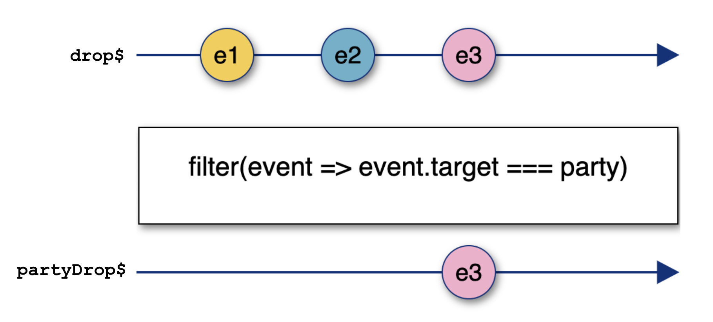
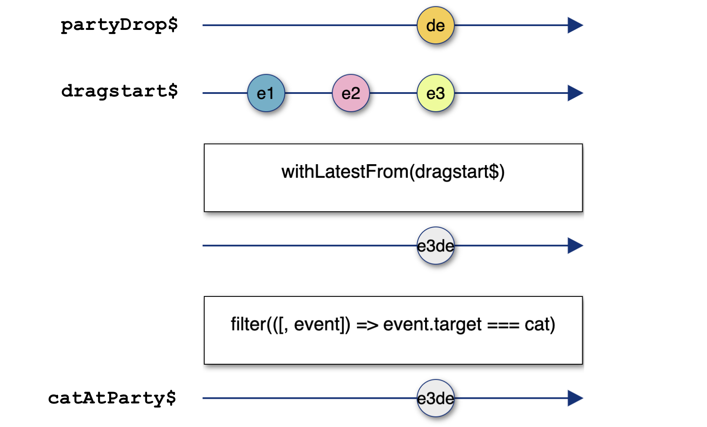

import Accordion from "../components/Accordion";
import Caption from "../components/Caption";
import GIF from "../components/GIF";
import ScrollToTopButton from "../components/ScrollToTopButton";

<ScrollToTopButton />

**TODOS**

- [ ] Compress all the images & GIFs in the article
- [ ] Check all the images in mobile, all good?
- [ ] Check all the captions in the images for typos and meaning, grammarly fails to check that

* <a
    href="https://goodguydaniel.com/blog/why-reactive-programming"
    target="_blank"
    title="Why You Should Consider Reactive Programming | goodguydaniel.com"
  >
    Part 1 - Why You Should Consider Reactive Programming
  </a>
* <a
    href="https://goodguydaniel.com/blog/reactive-programming-fundamentals"
    target="_blank"
    title="Fundamentals of Reactive Programming | goodguydaniel.com"
  >
    Part 2 - Fundamentals of Reactive Programming
  </a>
* **Part 3 - Hands-on Reactive Programming with RxJS**
* 🔜 Part 4 - Reactive Programming: The Good and the Bad
* 🔜 Part 5 - List of Awesome RxJS and Reactive Programming Resources

---

This part of the series it's all about getting your hands dirty!

- [Warmup - Handle a click event with RxJS](#warmup---handle-a-click-event-with-rxjs)
- [RxJS overview](#rxjs-overview)
- [Let's build something!](#lets-build-something)
  - [Take the cat to the party](#take-the-cat-to-the-party)
  - [Level 1 - Combining streams of DOM events](#level-1---combining-streams-of-dom-events)
  - [Level 2 -Hacking race conditions with artificial delays (something to avoid)](#level-2--hacking-race-conditions-with-artificial-delays-something-to-avoid)
  - [Level 3 - Merging streams into one stream](#level-3---merging-streams-into-one-stream)
    - [Bonus for Level 3](#bonus-for-level-3)
  - [Level 4 - CHANGE TITLE Flatten Observables & Cancellation](#level-4---change-title-flatten-observables--cancellation)
- [Closing Notes](#closing-notes)

We're going to start with a small refresher from <a href="https://goodguydaniel.com/blog/reactive-programming-fundamentals" target="_blank" title="Fundamentals of Reactive Programming | goodguydaniel.com">the previous article</a>, we're going to start with a quick refresher of two concepts we've explored **streams** and **operators** by implementing a click event handlers with <a href="https://rxjs-dev.firebaseapp.com/" target="_blank" title="A reactive programming library for JavaScript">RxJS</a>. Next, we'll have a brief overview of RxJS, followed by the main challenge of building a small animated game that teach us how to approach building something the reactive way.

#### Warmup - Handle a click event with RxJS

Here's how a usual JavaScript event handler function looks like.

```html
<button id="btn">+1</button>
```

```javascript
const btn = document.getElementById("btn");
let counter = 0;
btn.addEventListener("click", (event) => {
  counter++;
  console.log(`Incremented ${counter}`);
});
```

In the above code, we're merely incrementing `counter` that is global and logging its value each time we update it.

Usually, we don't increment globals or `console.log` directly in real-life apps, but we do have other side-effects in place (like updating something else in the UI, triggering a web request, firing an animation, etc.). With this approach, we're pretty much stuck with the event handler. You can always organize your code to split concerns, but it seems the event handler is already doing two very distinct things, and we're barely getting started.

Here's how you should visualize a stream of click events.

<!-- NOTE: For better screen size fitting all marble diagrams shall have 400px -->


<Caption
  text={() => (
    <p>
      <b>e</b> stands for <b>event</b> and its the value that is pushed to the stream at each click, just like you would
      have a payload <b>event</b> in the typical <b>onClick</b> callback
    </p>
  )}
/>

<br />
<br />

Let's take a look at how this looks like in the reactive world, with RxJS.

```javascript
let counter = 0;
const click$ = fromEvent(btn, "click");
click$.subscribe((event) => {
  counter++;
  console.log(`Incremented ${counter}`);
});
```

A few things to notice here:

- <a
    href="https://www.learnrxjs.io/learn-rxjs/operators/creation/fromevent"
    target="_blank"
    title="fromEvent - Learn RxJS"
  >
    fromEvent
  </a> is the tool in RxJS that will allow you to transform any DOM event into an Observable, a stream of events of a given
  type (e.g., click).
- `subscribe` well, without subscribing to our stream, would just be dead code. The code path that we're setting up inside our `pipe` will never be visited if you don't subscribe to it, since no values are emitted.
- The `$` is just a common (non-standard) notation to identify streams in your code - totally optionally, no need to follow - if you're curious, you can read more about it <a href="https://medium.com/@benlesh/observables-and-finnish-notation-df8356ed1c9b" target="_blank" title="Observables and Finnish Notation. Once in a while I’m asked what I think… | by Ben Lesh | Medium">Observables and Finnish Notation</a>.

A cool thing here is that opposite to the click event handler, you can subscribe to the stream of clicks as many times as you want and split all kinds of different tasks into separate subscriptions that share the same event listener! In a way, things are opening up, you get a more flexible model to organize your code, compared to an event handler callback. How about that? There's a lot more flexibility compared to the classic callbacks.

**Anything can be a stream, remember that**. This should get you warmed up for the real challenge later in the article. Before that, let's take a look at how the overall structure of RxJS looks like.

#### RxJS overview

I would highly recommend you later to go through the <a href="https://rxjs-dev.firebaseapp.com/guide/overviewhttps://rxjs-dev.firebaseapp.com/guide/overview" target="_blank" title="RxJS - Introduction">RxJS official docs overview</a>; it complements a few concepts I've covered in <a href="https://goodguydaniel.com/blog/reactive-programming-fundamentals" target="_blank" title="Fundamentals of Reactive Programming | goodguydaniel.com">the previous article</a>. But for now, I want to focus on two things only: **creating streams and manipulating them**. Looking at RxJS, you'll see that you can identify two big groups of "things":

- **Stream creators/producers** are tools that will allow you to take anything and make it a stream. In the previous section, for example, we used `fromEvent` to transform DOM click events into an Observable, **a stream that you can subscribe to**.
- **Operators** are instruments that will allow you to not only hook into the stream to perform operations with the data flowing through it but also combine them, as we'll see later on.

#### Let's build something!

Now we've had our refresher, we can jump into building a small animated game with RxJS, something more complex.

##### Take the cat to the party

The game we're building is called **"Take the cat to the party"**, here's how it goes down.

<GIF name="take-cat-to-party" alt="take the cat to the party game demonstration" playing={false} />
<Caption
  gif={true}
  text={"The game consists in dropping a picture of a cat into a picture of a party with cats, within 5 seconds."}
/>

- There's a cat in a motorbike in your top left corner (draggable HTML element).
- There's a decoy at the bottom left corner (draggable HTML element).
- There's a party at the right bottom corner of the page (our drop zone).
- We need to drop the cat at the party in less than 5 seconds to win. Nothing should happen if the decoy is the dragged element.
- While dragging the cat, there's an animation of the cat driving to the party and a counter appearing at the top right corner.

We're going to split this into **4 levels**. Per each level, I'll explain the goal we're trying to achieve, show you how the implementation looks, and what it does with plenty of detail. Feel free to try and code the levels before checking the solution. You can <a href="https://github.com/danielcaldas/take-the-cat-to-the-party" target="_blank" title="danielcaldas/take-the-cat-to-the-party: Learn reactive programming with RxJS the fun way">check out this repo</a> if you're willing to give it a try. The file <a href="https://github.com/danielcaldas/take-the-cat-to-the-party/blob/master/cat-party-empty.html" target="_blank" title="danielcaldas/take-the-cat-to-the-party: Learn reactive programming with RxJS the fun way template file">cat-party-empty.html</a> contains the necessary boilerplate in a single HTML file. You can just open it in the browser and start coding.

Before we start, let's take a look at some boilerplate code that we have set already.

There are a bunch of RxJS taken from the global `window` at the top (I'm just injecting RxJS as with a `<script>` at the top level), you can just ignore for now. Then we have our markup appended to the element's `app` `innerHTML`. Just some boilerplate, don't bother with the detail.

```html
<head>
  <script src="https://cdnjs.cloudflare.com/ajax/libs/rxjs/6.5.5/rxjs.umd.js"></script>
  <script src="https://cdnjs.cloudflare.com/ajax/libs/rxjs/6.5.5/rxjs.umd.js.map"></script>
</head>
<body>
  <div id="app"></div>
  <script>
    const {
      map,
      // ...
    } = window.rxjs.operators;
    const {
      fromEvent,
      // ...
    } = window.rxjs;
    // ...
    document.getElementById("app").innerHTML = `
      <h2>Take the 🐈 to the 🎉</h2>
      <div id="loader" style="display:none;position:absolute;right:0;z-index:-1;">
        
        <span id="countdown" style="top:0;right:0;position:absolute;z-index:9999;font-weight:bold;font-size:46px;">-</span>
      </div>
      <div id="drop-zone" style="position:absolute;right:5px;bottom:5px;width:180px;height:180px;border:2px dashed black;z-index:2;"></div>
      
      </div>
      
      <div id="decoy" draggable="true" style="font-size:28px;position:absolute;left:20px;bottom:10px;text-align:center;cursor:grab;font-weight:bold;">DECOY</div>
    `;
  </script>
</body>
```

The next block contains a few of the DOM elements we'll often be referring to.

```javascript
const cat = document.getElementById("cat");
const party = document.getElementById("drop-zone");
const loading = document.getElementById("loader");
const countdown = document.getElementById("countdown");
```

Finally, **we introduce three streams that we'll use quite often while going through the challenge, these are the most basic building blocks of our solutions.**

```javascript
const dragstart$ = fromEvent(document, "dragstart");
const dragEnd$ = fromEvent(document, "dragend");
const drop$ = fromEvent(document, "drop");
```

<br />
<br />

##### Level 1 - Combining streams of DOM events

- We should be able to take the cat to the party by dragging it.
  - Place the cat inside the party together with other cats.
  - We also want to hide/remove the original cat element when we're dropping the cat at the party.

Let's follow a bottom-up approach. We'll start by building some specific streams that will allow us to assemble more complex behaviors as we move along.

Let's start by answering the following: how do we know that an HTML element has been dropped at the `party`? We'll need to detect any `drop` event that occurs in the `party` element.

```javascript
const partyDrop$ = drop$.pipe(filter((event) => event.target === party));
```



<Caption
  text={() => (
    <p>
      <b>e</b> stands for <b>event</b> and it's the value pushed to the stream at each drop event in the whole document!{" "}
      <b>e1</b>, <b>e2</b> and <b>e3</b> have different <code>event.target</code> (target DOM elements).
    </p>
  )}
/>

Cool, we now have a stream that emits a `drop` event every time something is dropped in `party`. I would like to pause and add further detail on this marble diagram. Notice that we read from top to bottom, meaning the last timeline is the only one that really matters, because in practice we'll just subscribe to `partyDrop$`. In this case since we won't subscribe to `drop$` directly, think of it as an auxiliary conceptual timeline which is a step towards shaping the ideal stream to tackle our task: `partyDrop$`.

Another relevant detail on the marbles diagram: `e1` and `e2` marbles don't make it to `partyDrop$` (bottom stream). For those events,
`event.target` it's not `party`, this means the user did not drop the HTML element in the `party`.

**At this point we can already notice the exceptional compositional capabilities of streams and how easy it is to plug & play the smaller blocks (such as `drop$`) to build higher level streams.**

Next, let's see how we can detect that the `cat` is dropped at the `party`.

```javascript
const catAtParty$ = partyDrop$.pipe(
  withLatestFrom(dragstart$),
  filter(([dropEvent, dragStartEvent]) => dragStartEvent.target === cat)
);
```

Alright, a few things are going on here. We're familiar with <a href="https://www.learnrxjs.io/learn-rxjs/operators/combination/withlatestfrom" target="_blank" title="withLatestFrom - Learn RxJS">withLatestFrom</a>, but this time, it's a bit more complex to perceive. We're looking into a stream of `dragstart` events `dragstart$` and asking it for the last value (DOM element) emitted in that stream; this is the same as saying that we want the last draggable element in the page that emitted a `dragstart` event! Next, we have `filter`. We're going to use `filter` to narrow down our stream to allow `dragstart` events to pass through only if their target element is `cat`! And that's it! We have a stream that will emit an event every time we drop the cat at the party.



<Caption text={"TODO"} />

In the above diagram, `e1`, `e2` and `e3` are `dragstart` events (`dragstart$` stream) that might come from anywhere in the page. `de` represents a `drop` event at the `party`. Notice how `withLatestFrom` operates by bringing together the last element on `dragstart$` which is `e3` and puts it together with the `party` element which is published onto the `dragend$` stream. Now because `e3` event target is actually the `cat` you'll get `e3` pushed onto our final stream `catAtParty$`!

But we're not finished just yet; we need to leverage the work we've constructed so far to actually render the `cat` in the `party`. For that, we just need to subscribe to our `catAtParty$` stream and do some DOM manipulations.

```javascript
catAtParty$.subscribe(([partyDropEvent, dragStartEvent]) => {
  // some console.logs to check what we really get subscribing to catAtParty$
  // console.log({ partyDropEvent, dragStartEvent });
  // console.log({ partyDropEvent: event.type, dragStartEvent: event.type });
  cat.remove();
  party.appendChild(cat);
});
```


<Caption
  text={() => (
    <p>
      Here you clearly see the output of our above <b>console.log</b> where we have the `drop` event and the `dragstart`
      as payload for our subscription.
    </p>
  )}
/>

If you're following this point, you'll notice that although we can drag the cat perfectly, we still see the original `cat` element while carrying it.

<GIF name="game-level-1-opacity-before" alt="dragging the cat without manipulating the opacity value" playing={false} />
<Caption gif={true} text={"We still see the original cat element while dragging it."} />

<GIF name="game-level-1-opacity-after" alt="dragging the cat with opacity manipulation" playing={false} />
<Caption
  gif={true}
  text={() => (
    <p>
      Setting the cat's element opacity to <b>0</b> yields a more natural user experiences.
    </p>
  )}
/>

To achieve the same behavior we have in the above GIF, we want to toggle the `cat` element's opacity while dragging. Yes, another side effect, we can actually simply create another subscription to take care of this.

```javascript
const catDragStart$ = dragstart$.pipe(filter((e) => e.target === cat));
const catDragEnd$ = dragend$.pipe(filter((e) => e.target === cat));
catDragStart$.subscribe((event) => {
  cat.style.opacity = 0;
});
catDragEnd$.subscribe(() => {
  cat.style.opacity = 1;
});
```

And done with Level 1!

I want to leave a challenge for the reader. Looking at how we're setting the opacity value of the `cat` element, could we somehow handle everything in one single subscription instead of two? I would suggest you to read the whole article and come back to this one later, you should be then able to nail it then.

<Accordion summary="Hint">
  Check the operator <code>merge</code>.
</Accordion>

<br />

<Accordion summary='Solution'>

```javascript
const catDragStart$ = dragstart$.pipe(filter((e) => e.target === cat));
const catDragEnd$ = dragend$.pipe(filter((e) => e.target === cat));
const opacity$ = merge(catDragStart$.pipe(mapTo(0)), catDragEnd$.pipe(mapTo(1)));

opacity$.subscribe((value) => {
  cat.style.opacity = value;
});
```

</Accordion>

<br />

##### Level 2 -Hacking race conditions with artificial delays (something to avoid)

- We should announce the cats' arrival with a `window.alert` message.
  - Before triggering the `window.alert` we'll want to make sure the `cat` is actually rendered at the `party`.

So we already have a stream that emits an event each time we drag the cat to the party, it's called `catAtParty$`. Our work here is mostly done. We just need to subscribe to it.

```javascript
catAtParty$.subscribe(() => {
  window.alert("Cat is at the party! You win!");
  window.location.reload();
});
```

<br />
<br />

<GIF name="game-level-2-no-cat" alt="demonstration asynchronous rendering cat DOM element" playing={false} />
<Caption
  gif={true}
  text={() => (
    <p>
      <b>window.alert</b> is triggered when we drop the cat at the <b>party</b>, but the <b>cat</b> is not rendered at
      the <b>party</b>!
    </p>
  )}
/>

Hmm.. strange, we did everything right but the `window.alert` triggers before we get to actually render the `cat` at the `party`, what a bummer.

It seems that the DOM changes don't kick in before we trigger the alert; that's because the rendering is asynchronous, and the value on the screen only gets updated later on after we're done with executing this function. I don't want to spend much time fixing this since I don't have any mechanism to tell me whether the DOM node has been rendered successfully. I'm going to code a hack and trigger the alert inside a `setTimeout` that should buy us some time to correctly render the cat element.

```javascript
catAtParty$.subscribe(() => {
  setTimeout(() => {
    window.alert("Cat is at the party! You win!");
    window.location.reload();
  }, 100);
});
```

<br />
<br />

<GIF
  name="take-cat-to-party"
  alt="take the cat to the party game demonstration after applying delay on render"
  playing={false}
/>
<Caption
  gif={true}
  text={() => (
    <p>
      Great! The <b>window.alert</b> is triggered after the <b>cat</b> element is rendered at the <b>party</b>!
    </p>
  )}
/>

It works. We can achieve a similar **hack** with RxJS without having a solution based on callbacks that keep our subscription handler clean (**but still a hack!**).

```javascript
catAtParty$.pipe(delay(100)).subscribe(() => {
  window.alert("Cat is at the party! You win!");
  window.location.reload();
});
```

See that `delay` there? That's another operator. It **allows you to hold the value in the stream for a determined amount of time before pushing it to the subscribers**. So what's happening here is that instead of the Observer (subscription) being aware that we have to code a hack to trigger the alert after the cat enters the party, we shift that responsibility to the Observable, the stream is now the _hacky_ code that is delaying the whole thing. This is super powerful, the way you can shift responsibilities and broadcast your changes to all the subscribers. Yes, all the subscribers will receive a delayed update! **This can simultaneously be a gift and a wrecking footgun!**

##### Level 3 - Merging streams into one stream

- We want to display a GIF while the cat is moving.

In our markup, there's a GIF positioned at the top right corner. We want to show it while dragging the cat and hide it again once we drop the cat.

We already have two streams: `catDragStart$` and `catDragEnd$` . We need to combine them to form a new stream. Let's try and draw a small diagram of what that stream should look like.

Here's out two separate streams of drag events.


<Caption
  text={() => (
    <p>
      In the image, <b>ds</b> symbolizes a <b>dragstart</b> event, and <b>de</b> represents a <b>dragend</b> event.
    </p>
  )}
/>

Our GIF is an HTML element whose `display` attribute is set to `"none"` by default. We'll want to set it to `""` (empty string) to make it visible and back to `"none"` once it's time to hide it again. Our side effect should look something like this:

```javascript
// shouldHideGIF would be true in case we need to hide the GIF
const v = shouldHideGIF ? "none" : "";
loading.style.setProperty("display", v);
```

Let's try to build a stream to feed to this function a value for `display` that reflects whether the cat is being dragged or not. **Our stream should remove the necessity of the imperative logic dictated by the ternary operator, we'll create values that react to changes to replace the imperative code**.

First, let's look back at our streams `catDragStart$` and `catDragEnd$`. When `catDragStart$` emits a value, we want to set the `display` to `""`. So this means we need to somehow transform our stream of events into a stream of empty strings. Each time a string is emitted, we shall pass that value onto the function that will set the `display` property on the `loading` element.


<Caption text={"Mapping each event to ''."} />

After you apply an operator, you transform your stream into a more refined one, better suited to the task you're trying to tackle! You're making every pushed value to the topmost timeline flow through a function provided in the `map` operator. That function will map each value into the bottom timeline, your _"final"_ stream. If you subscribe to it now, you will receive empty strings instead of DOM events!

The same thing should happen to `catDragEnd$`.


<Caption text={"Mapping each event to 'none'."} />

Now we have two streams, and we could just subscribe to each one of them and set the value of the `"display"` property for the `loading` element!

```javascript
catDragEnd$.pipe(map((event) => "none")).subscribe((v) => loading.style.setProperty("display", v));
catDragStart$.pipe(map((event) => "")).subscribe((v) => loading.style.setProperty("display", v));
```

Although this works, we could further refine our streams and **merge** them into a single one to achieve the following:


<Caption text={"TODO: missed image in the middle level3_3"} />

Awesome! The `merge` operator gives us the power to take to streams and merge them into one so that the values of the `"display"` of the `loading` element flow through a single stream (a single source of truth). Here's how the code looks like.

```javascript
const display$ = merge(catDragStart$.pipe(map((event) => "")), catDragEnd$.pipe(map((event) => "none")));
display$.subscribe((v) => loading.style.setProperty("display", v));
```

So we now just need one subscription to handle this toggling of the GIF in our game.

###### Bonus for Level 3

I feel too overwhelmed by the tremendous amount of operators offered by RxJS. The API is insanely large. To the point that we could further simplify the above implementation with the operator `mapTo`.

```javascript
const display$ = merge(catDragStart$.pipe(mapTo("")), catDragEnd$.pipe(mapTo("none")));
display$.subscribe((v) => loading.style.setProperty("display", v));
```

You get the same result as applying `map` but without needing to provide a function, because we're really not doing anything else rather than returning a hardcoded value on that inline function.

##### Level 4 - CHANGE TITLE Flatten Observables & Cancellation

- The cat needs to make it to the party in less than 5 seconds! He only has 5 seconds of gas in his bike.

Now that we know a bit about creating and manipulating streams, it's time for our last challenge.

We need to code a new path in our game, where the user loses if he/she can't get the cat to the party within 5 seconds. This looks like a countdown, with a few actions tied to it:

1. The countdown must be **interrupted** if the player manages to win within 5 seconds (we'll learn cancellation here. It's a piece of cake with streams and RxJS!).
2. In case the countdown ends, we need to display a message to the user informing it that he/she loses.

As in the previous levels, let's build this incrementally, starting to develop individual streams to later combine them into more high-level tasks.
First, let's build a countdown. To emphasize how RxJS shines here, let's first see how we would make a countdown with native JavaScript APIs.

```javascript
function countdown(seconds) {
  let secondsLeft = seconds;
  let intervalId;

  intervalId = setInterval(() => {
    if (secondsLeft === 0) {
      console.log("time's up!");
      clearInterval(intervalId);
    } else {
      console.log(secondsLeft);
      secondsLeft--;
    }
  }, 1000);
}
countdown(5);
```

That's what we would get as a rough implementation of a countdown. We need to keep track of the timer identifier in a variable to ensure we clean up after running the `setInterval` provided callback the expected amount of times.

Now here's how you can do the same with RxJS.

```javascript
timer(0, 1000)
  .pipe(
    map((t) => 5 - t),
    take(5 + 1) // emit one more 5+1 seconds so that we get to 0
  )
  .subscribe({
    next: (secondsLeft) => {
      if (secondsLeft === 0) {
        console.log("time's up!");
      } else {
        console.log(secondsLeft);
      }
    },
  });
```

<small>
  Ignore the <i>off by one</i> details of this logic (you can worry about it later), try to focus on how we're
  manipulating the timer stream.
</small>

Let's examine the above code 🤯. This time we're not creating a stream from an event or anything like that. Instead, we use `timer` from RxJS to generate a timer stream that emits a new value every second.

Now a timer emits values in ascending order (0, 1, 3, etc.). We'll want to reverse that to display an actual countdown to the user. To reverse the numerical value on the stream, we simply use `map`. We should only give the user 5 seconds to drag the `cat` to the `party`. This translates to only pushing `5 + 1` (`+1` because we start at `0`, this way, we'll get to 5, which will display the `0` in the countdown for the user) values to the stream! That's quite simple with RxjS, just literally say that you want to `take(5 + 1)` values; once the stream emits the 6th value, it will complete automatically and stop emitting values!


<Caption text={"TODO: missed image in the middle level4_1"} />

In the above image, the bottom timeline represents the stream; notice the pipe (**|**) at the end of the timeline indicates that the stream completes after emitting the value **0**.

A crucial aspect to notice is that you'll trigger a new timer as soon as you subscribe. This is a <a href="https://goodguydaniel.com/blog/reactive-programming-fundamentals/#hot-observable-vs-cold-observable" target="_blank" title="Fundamentals of Reactive Programming, Cold Observable">Cold Observable</a> (we've covered this topic in the <a href="https://goodguydaniel.com/blog/reactive-programming-fundamentals" target="_blank" title="Fundamentals of Reactive Programming | goodguydaniel.com">the previous article</a>)! Our `countdown$` will start emitting values right away upon subscription, so we can't just `.subscribe()` We'll have to subscribe to the countdown when the user starts dragging the `cat` element. Let's see how we can implement that.

Now remember we had a stream `catDragStart$`; we'll use that to trigger our countdown. **But how can we trigger a subscription to a stream from within another stream?** In my opinion, this is a hard concept to comprehend; I think the moment it really clicked for me was when I started thinking about it the following way:

I have a stream `A`, and a stream `B`; if I want to trigger stream `B` once stream `A` emits a value, I need to pass the flow control from `B` to `A`, meaning my streams will flatten A and B meaning we'll get one stream, and `A` will in a way be "left behind", we're interested in values pushed to `B` now.

That's where the `switchMap` operator comes to rescue. `switchMap` allows you to trigger a subscription from within a stream to a second stream and subscribe to its updates! Not clear yet? Think of it this way `switchMap` allows you to switch to a new observable. Ok, let's look at our countdown implementation, now that we have this information.

```javascript
const countdown$ = timer(0, 1000).pipe(
  map((t) => 5 - t),
  take(5 + 1) // emit one more 5+1 seconds so that we get to 0
);
const countdownRunning$ = catDragStart$.pipe(switchMap(() => countdown$));
countdownRunning$.subscribe((secondsLeft) => {
  countdown.innerText = `${secondsLeft}`;
});
```

Notice the return value of `switchMap` is `countdown$`, this means that when a `dragstart` event is emitted in `catDragStart$` the following things will happen:

1. Since we subscribed, the DOM event will flow through the pipe and hit our `switchMap` operator.
2. We'll automatically subscribe to `countdown$` and start emitting its values leaving the `dragstart` event behind (because we don't really need it for this task).
3. In our subscription handler, we simply do a DOM mutation to the element that displays our countdown value so that the user gets the time left displayed on the screen.

Here's how this looks like conceptually:


<Caption text={"TODO: missed image in the middle level4_2"} />

As you can see, as soon as a `ds` (`dragstart` event) is pushed onto our `catDragStart$` stream, `switchMap` will kick in and subscribe to our `countdown$` stream, "passing the ball" (moving the flow of control) onto the countdown, meaning we'll start to push to our subscribers the seconds left in the countdown almost like if we would have subscribed to the `countdown$` in the first place.

<small>
  Note: To read more on <b>switchMap</b>{" "}
  <a
    href="https://www.learnrxjs.io/learn-rxjs/operators/transformation/switchmap"
    target="_blank"
    title="switchMap - Learn RxJS"
  >
    checkout learnrxjs.io
  </a>
  .
</small>

We can now leverage `countdownRunning$` to display an alert that the user has lost.

```javascript
countdownRunning$.pipe(filter((secondsLeft) => secondsLeft === 0)).subscribe(() => {
  window.alert("Cat didn't make it! You lose!");
  window.location.reload();
});
```

We have a filter to check for the second `0`; this way, we're basically ensuring that we just emit a value when the countdown runs out. Similarly to **Level 2**, we have a `delay` with random time to safeguard our countdown value gets rendered with `0` on the screen before we trigger the alert.

Only one thing left! If you're following up until this point, you're probably wondering why the counter is not reset once you stop dragging the cat. See the following GIF to understand what I'm referring to.

<GIF name="take-cat-to-party" alt="take the cat to the party game demonstration" playing={false} />
<Caption gif={true} text={"Hmm.. Strange the counter does not reset!"} />

Let's look at our `countdown$` implementation once more.

```javascript
countdownRunning$
  .pipe(
    filter((secondsLeft) => secondsLeft === 0),
    delay(100)
  )
  .subscribe(() => {
    window.alert("Cat didn't make it! You lose!");
    window.location.reload();
  });
```

Now, it's pretty clear that we're not doing anything to "stop" the counter. Once we subscribe to `countdown$` with the `switchMap` operator that we just went through, there's no stopping it, it will go on until it reaches the end, and when this happens, we'll display the alert to the user. Ideally, we would stop the counter upon any of the two following events:

1. **When the cat arrives at the party**. Also partially done, we have a stream `catAtParty$`, once a value is pushed into this stream, you know the `cat` was dropped at the `party`.
2. **We stop dragging the cat**. That's easy; we already have a stream `catDragEnd$`, each emitted value means we just dropped the `cat` element. You might be thinking the first point would be enough, but remember the cat can be dropped literally anywhere on the screen. We have no guarantees that it will get dropped at the party.

Meet `takeUntil`, this operator allows you to stop listening to a stream until something happens! Let's look at the implementation of the `countdown$`.

```javascript
const countdown$ = timer(0, 1000).pipe(
  map((t) => 5 - t),
  take(5 + 1), // emit one more 5+1 seconds so that we get to 0
  takeUntil(/*??? Something we'll figure this out later*/)
);
```

Now, what is that **argument** of the `takeUntil` operator? `takeUntil` receives a stream, once that **stream** emits a value, our `countdown$` will stop emitting, thus canceling the clock and giving our users a chance to retry dragging the `cat` to the `party`.

But we have two streams, `catDragEnd$` and `catAtParty$`, can we make it one? Yes, we can! We've already met `merge`! This operator can take multiple streams and combine into a single one, think of it as a funnel.


<Caption text={"TODO: missed image in the middle level4_3"} />

Let's call this last stream `cancelCountdown$`. Here's the final implementation of Level 4 with cancellation.

```javascript
const cancelCountdown$ = merge(catDragEnd$, catAtParty$);
const countdown$ = timer(0, 1000).pipe(
  map((t) => 5 - t),
  take(5 + 1), // emit one more 5+1 seconds so that we get to 0
  takeUntil(cancelCountdown$)
);
const countdownRunning$ = catDragStart$.pipe(switchMap(() => countdown$));
countdownRunning$.subscribe((secondsLeft) => {
  countdown.innerText = `${secondsLeft}`;
});
countdownRunning$
  .pipe(
    filter((secondsLeft) => secondsLeft === 0),
    delay(100)
  )
  .subscribe(() => {
    window.alert("Cat didn't make it! You lose!");
    window.location.reload();
  });
```

You can check out <a href="https://github.com/danielcaldas/take-the-cat-to-the-party" target="_blank" title="danielcaldas/take-the-cat-to-the-party: Learn reactive programming with RxJS the fun way">the complete implementation of this challenge here</a>.

<br />
<br />

#### Closing Notes

Here are the concepts you've learned by building this simple game:

1. **Creating streams** from DOM events.
2. **Manipulating streams** with basic operators such as `map`, `filter`.
3. **Combining streams** with operators such as: `withLatestFrom`, `switchMap`, and `merge`.
4. **Cancellation**, being able to stop listening to a specific event based on another. In our last level, we've used `takeUntil` to achieve this.

Now go out there and try to apply these concepts to build your own applications. I would be pleased to hear from you if you've learned something throughout this blog/tutorial.

In the upcoming articles, I'll share with you the good and bad parts of adopting reactive programming and start using RxJS in your codebase, and at last, I'll share with you a bunch of fantastic resources to learn RxjS and reactive programming.

<br />
<br />

---

- <a
    href="https://goodguydaniel.com/blog/why-reactive-programming"
    target="_blank"
    title="Why You Should Consider Reactive Programming | goodguydaniel.com"
  >
    Part 1 - Why You Should Consider Reactive Programming
  </a>
- <a
    href="https://goodguydaniel.com/blog/reactive-programming-fundamentals"
    target="_blank"
    title="Fundamentals of Reactive Programming | goodguydaniel.com"
  >
    Part 2 - Fundamentals of Reactive Programming
  </a>
- **Part 3 - Hands-on Reactive Programming with RxJS**
- 🔜 Part 4 - Reactive Programming: The Good and the Bad
- 🔜 Part 5 - List of Awesome RxJS and Reactive Programming Resources
