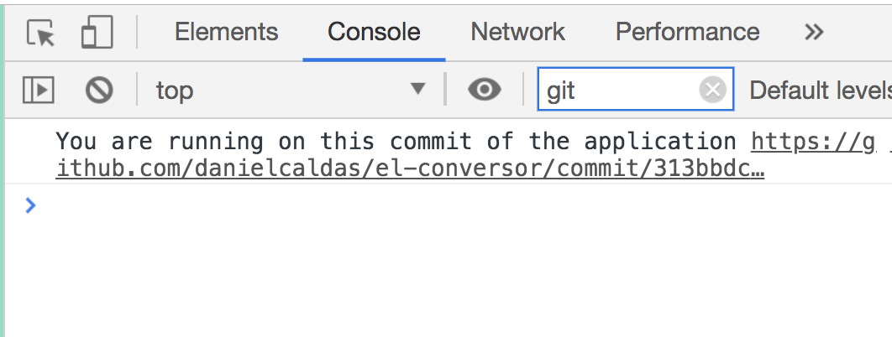

import Accordion from "../components/Accordion";
import Caption from "../components/Caption";
import GIF from "../components/GIF";
import ScrollToTopButton from "../components/ScrollToTopButton";

<ScrollToTopButton />

The odds are high that you're using <a href="https://webpack.js.org/" target="_blank" title="a bundler for javascript and friends">webpack</a> to bundle your assets. If you're looking into an excellent way to feed environment variables to your applications, <a href="https://webpack.js.org/plugins/define-plugin/#usage" target="_blank" title="the defineplugin allows you to create global constants which can be configured at compile time">DefinePlugin</a> might well be the answer.

### tl;dr

If you want to pass environment variables and use it within your JavaScript, you need to:

1. Create the environment variable.

```bash
MY_ENV_VAR="sweet env var"
```

2. In your webpack config, use the `webpack.DefinePlugin`.

```javascript
new webpack.DefinePlugin({
  // it won't work without JSON.stringify!!!
  myEnvVar: JSON.stringify(process.env.MY_ENV_VAR),
});
```

3. In your JavaScript.

```javascript
console.log(`Accessing my env var like a ninja: ${myEnvVar}`);
```

<br />
<br />

### Some Background

One of these days, I had this exciting challenge, I was integrating some third party that required from me to provide the current commit hash of the code to a JavaScript SDK that performs some magic in bug tracking and versioning.

Well seemed pretty simple for me at the time. I need to take the commit hash at build time and somehow feed it to our JavaScript, whatever that means.

In this blog post, I'll explain step by step how to implement the following:

> We want to log in the console the link to the GitHub history of the application
> that points to the commit of the current version of the application.

#### The step by step

Here's a step by step implementation of the previously announced challenge. I will use one of my open source pet projects on GitHub, <a href="https://github.com/danielcaldas/el-conversor" target="_blank" title="a number to word list converter as a node backend and react/redux fronted">el-conversor</a>.

##### Step 1 - Grab the commit hash

I'm going to do this within a npm script in the <a href="https://github.com/danielcaldas/el-conversor/blob/master/package.json#L17" target="_blank" title="a number to word list converter as a node backend and react/redux fronted package.json">package.json</a>. In the `dev` npm script you can find the following:

```javascript
"dev": "COMMIT_HASH=\"$(git rev-parse HEAD)\" npm-run-all --parallel *:dev",
```

So in `COMMIT_HASH=\"$(git rev-parse HEAD)\"` we are basically assigning the output of the command `git rev-parse HEAD` to an env variable `COMMIT_HASH`.

##### Step 2 - Configure webpack.DefinePlugin

Now, let's dive into the <a href="https://github.com/danielcaldas/el-conversor/blob/master/package.json#L17" target="_blank" title="a number to word list converter as a node backend and react/redux fronted package.json">webpack.config.js</a>. Well it's not that complicated, the only nasty detail is that even if you want to pass in a simple string, you need to wrap it with a `JSON.stringify` otherwise, webpack dumps whatever text comes out of your environment variable and dump it in your JavaScript, and you get a very nasty syntax error. So let's use the <a href="https://webpack.js.org/plugins/define-plugin/#usage" target="_blank" title="the defineplugin allows you to create global constants which can be configured at compile time">DefinePlugin</a>:

```javascript
new webpack.DefinePlugin({
  __commitHash__: JSON.stringify(process.env.COMMIT_HASH),
});
```

**Pro Tip**: You might be wondering why the strange naming `__commitHash__,` well the prefix and suffix underscores are just a way to prevent naming collisions. I hope that you don't often use `__var__` as a style to name variables in JavaScript, well I don't, that's why I found this extremely unlikely to collide.

##### Step 3 - Use the environment variables

In the end, we use the environment variable. In this case to `console.log` a helpful GitHub link:

```javascript
console.log(
  `You are running on this commit of the application https://github.com/danielcaldas/el-conversor/commit/${__commitHash__}`
);
```

You can see the final result in the image below, it logs:

> "You are running on this commit of the application [https://github.com/danielcaldas/el-conversor/commit/aad949425d37ae8d8f4ef0285e8ba2df4e4df6b3](https://github.com/danielcaldas/el-conversor/commit/aad949425d37ae8d8f4ef0285e8ba2df4e4df6b3)"



<Caption />
