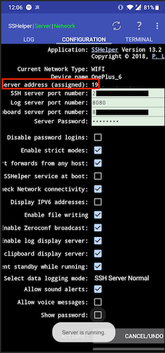

import Accordion from "../components/Accordion";
import Caption from "../components/Caption";
import GIF from "../components/GIF";
import ScrollToTopButton from "../components/ScrollToTopButton";

<ScrollToTopButton />

**tl;dr** SSH into your android and download the files with <a href="https://linux.die.net/man/1/scp" target="_blank" title="scp(1): secure copy - Linux man page">scp</a>. <a href="https://play.google.com/store/apps/details?id=com.arachnoid.sshelper" target="_blank" title="SSHelper - Apps on Google Play">This one</a> works for me.

---

So this afternoon, I had decided to take some time to clear my smartphone, archive some old pictures and stuff. I usually park them on an external drive. Anyways, it happens that my <a href="https://www.oneplus.com" target="_blank" title="OnePlus 6 - OnePlus (Nederland)">OnePlus 6</a> does not connect to my new shiny <a href="https://www.apple.com/macbook-pro/" target="_blank" title="MacBook Pro - Apple">MacBook Pro</a>.

<br />
(╯°□°)╯︵ ┻━┻
<br />
<br />
<br />

#### USB/USB-C Cables

I tried, but Apple doesn't make it easy to recognize other devices.

#### SSH to the rescue!

I start browsing the Google Play store for some apps that allow me to run an SSH server on my smartphone. Quickly I've stumbled into <a href="https://play.google.com/store/apps/details?id=com.arachnoid.sshelper" target="_blank" title="SSHelper - Apps on Google Play">this</a>.

Straightforward setup, as you can see in the screenshot below.



<Caption text={() => <p>Here's how the app looks like running on a smartphone.</p>} />

Since my laptop and my smartphone are on the same network, they can communicate.

```bash
ssh admin@<my_phone_ip>
# enter password...

# then just copy stuff to my MacBook
scp -r Images <my_macbook_user>@<my_macbook_ip>:~/Desktop
```

Hope this tip helps you out in case you get stuck due to the usual apple _mumbo jumbo_.
