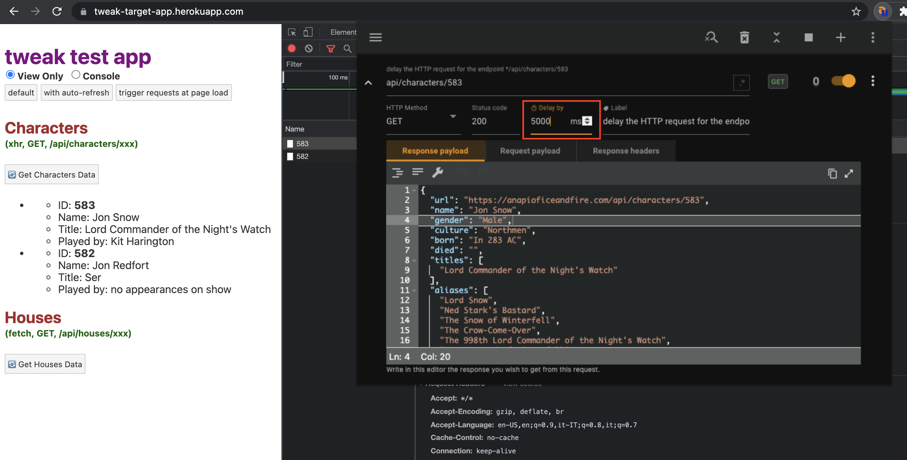

import Accordion from "../components/Accordion";
import Caption from "../components/Caption";
import GIF from "../components/GIF";
import ScrollToTopButton from "../components/ScrollToTopButton";

<ScrollToTopButton />

<i>
  This article was originally published by{" "}
  <a href="https://tweak-extension.com/" target="_blank" title="tweak browser extension">
    tweak
  </a>
  . You can checkout the original post{" "}
  <a
    href="https://tweak-extension.com/blog/how-to-simulate-delay-http-request"
    target="_blank"
    title="Simulate Delays in HTTP Requests | tweak browser extension"
  >
    here
  </a>
</i>
.

---

There might be a few reasons why we would want to delay an HTTP request:

- You want to **test how your UI behaves to a slow response** from an upstream service.
- There's a **race condition** in my code, and I suspect that it happens when the request to A is slower than the request B.
- You want to show off that beautiful loading animation you've been working on all day!

This approach makes use of the <a href="https://tweak-extension.com" target="_blank" title="tweak browser response API simulator">tweak browser extension</a>. I'll
use the tweak test application to delay an HTTP request that triggers a click
in a UI element. There's a loading animation in place with a timer, so we can
see the difference when actually delaying the HTTP request.

#### 1. Install the tweak browser extension

Jump over to the Chrome store and <a href="https://chrome.google.com/webstore/detail/tweak/feahianecghpnipmhphmfgmpdodhcapi" target="_blank" title="tweak mock HTTP requests on chrome store">install the tweak browser extension</a>. Also <a href="https://addons.mozilla.org/en-US/firefox/addon/tweak-extension/" target="_blank" title="tweak mock HTTP requests on firefox addons">available on Firefox</a>.

#### 2. Configure the request you want to delay

Here's how we set up the request to be delayed.

<Caption text="In the screenshot we have the request we're targeting to delay." />

1. Go over the browser network tab in the developer tools.
2. Now, collect the following information from the request you want to see delayed:
3. The **Request URL** <small>(or at least a piece of it that uniquely matches that URL)</small>.
   - The **HTTP method**.
   - Optionally grab the request payload (a.k.a. request body) when dealing with _POST_, _PUT_, or _PATCH_ requests.
   - The **HTTP response payload** (optionally, you can change it).
4. In the **tweak browser extension, click on the plus button** to add a new configuration.
5. **Fill in the configuration** with the information you collected.
   - Request URL.
   - Select your HTTP method from the dropdown.
   - Add the response payload.
   - Optionally specify the request payload for _POST_, _PUT_, or _PATCH_ requests.
   - Add the desired value of the **delay**.
   - Click on the _Play_ icon in the top bar of the extension to enable it.

<Caption
  text={() => (
    

      In this example we delay the request by <b>5 seconds</b>.
    

  )}
/>

 
 

#### 3. Trigger the request and see the delay in action

Now that you've enabled the browser extension, you need to trigger that HTTP request that you want to delay (e.g., refresh the page if the request fires at page load, click on some UI element if the request is dispatched based on some user interaction).

<GIF name="tweak-delay" playing={false} />

<Caption
  text={() => (
    

      After enabling the extension the targeted HTTP request is now delayed by <b>5 seconds</b>.
    

  )}
  gif={true}
/>

You're now able to delay HTTP
requests **across any environment, most importantly, without writing any code!**
At any time, you can go back to the extension and tweak the delay value!
If the value is set to `0`, no delay will be applied to your HTTP request.

You can consult
the <a href="https://tweak-extension.com/documentation" target="_blank" title="tweak browser extension documentation">official documentation</a> of
the browser extension if you want to explore its other capabilities.
