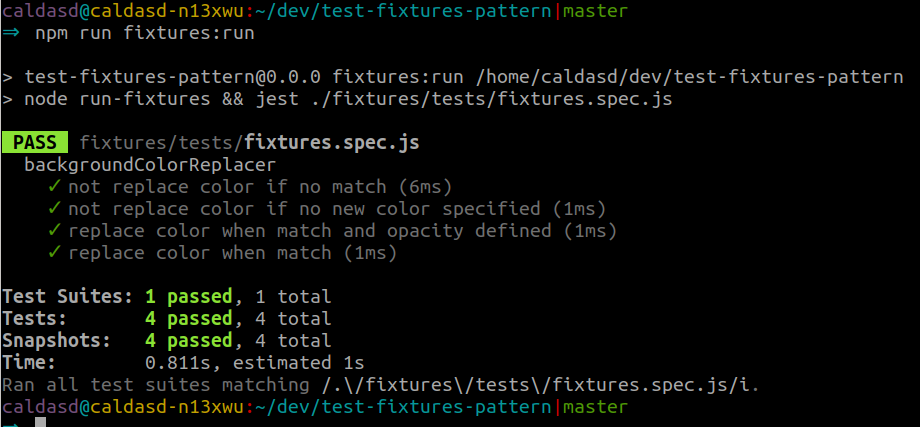

import Caption from "../components/Caption";
import GIF from "../components/GIF";
import ScrollToTopButton from "../components/ScrollToTopButton";

<ScrollToTopButton />

From project to project, I've seen applications structured in many different ways, but most of the time, no matter how different the software was, the testing techniques and structures were almost always the same. In this article, I want to share with you an experienced-based journey on how we can differently structure our tests; **I'm calling it a fixture based architecture** (or fixture based testing setup).

### About the unit tests we write

**On a very high level, manipulating the execution flow through inputs, and performing assertions on outputs is what happens with all the tests that we write** daily (weekly at least I hope), at different levels of granularity. Whether we want to test a small function or a large JavaScript module with multiple entry points, our ultimate goal is to perform a set of assertions that bring us the peace of mind and stability to move forward and build more stuff on top.

It happens that **in specific scenarios**, unit tests as we write them **might become pure overhead**. How come? Because we repeat the same structures, and we write the same boilerplate code again and again, without really thinking about how these particular tests could become more pleasant to maintain and scale. Why should I care about looking for alternatives? Because it can save you time, it **can document your codebase through well organized and self-explanatory test fixtures**.

Let's take a look at how we can move on from a _routine_ unit test setup, to a fixture based setup, through a dummy case study that I specially designed to demonstrate how tests can be set up in a much more declarative way.


<Caption source="https://makeameme.org/meme/im-so-excited-5af9fa" />

### Test fixtures

Before diving into details, let's take a few seconds to go through this definition of test fixtures that I came across in the <a href="https://github.com/junit-team/junit4/wiki/test-fixtures" target="_blank" title="junit-team/junit4 description of test fixtures">junit-team/junit4 GitHub wiki page</a>, In my opinion is extremely accurate.

> A test fixture is a fixed state of a set of objects used as a baseline for running tests. The purpose of a test fixture is to ensure that there is a well known and fixed environment in which tests are run so that results are repeatable. Examples of fixtures:

- Preparation of input data and setup/creation of fake or mock objects
- Loading a database with a specific, known set of data
- Copying a specific known set of files creating a test fixture will create a set of objects initialized to certain states.


<Caption source="https://memegenerator.net/instance/59947458/not-bad-obama-yup-sounds-about-right" />

### A case study

**Slowly moving to a fixture based test setup**

I'll create a small project to illustrate the concepts throughout this article, all the code is available in the repository <a href="https://github.com/danielcaldas/test-fixtures-pattern" target="_blank" title="GitHub, Daniel Caldas, test-fixtures-pattern case study project">danielcaldas/test-fixtures-pattern</a>. The project it's not actually something that you would use, but it's a good example to depict and analyze certain scenarios.

#### 📜 Small & dummy example for our case study

```
├── replacer.js
└── __tests__
    ├── replacer.test.js
    └── __snapshots__
        └── replacer.test.js.snap
```

```javascript:title=replacer.js
/**
 * Replaces background color that matches a certain color by another.
 * @param {string} target a css line
 * @param {Object} options a set of options for the new color.
 * @returns {string} the replaced expression or
 * the same as the input if nothing matches.
 */
function backgroundColorReplacer(target, options) {
  const { fromColor, toColor, opacity } = options;
  const bgc = `background-color: rgb(${fromColor.join(", ")})`;

  if (target === bgc && toColor && toColor.length) {
    const color = toColor.join(", ");

    if (opacity) {
      return `background-color: rgba(${color}, ${opacity})`;
    }

    return `background-color: rgb(${color})`;
  }

  return target;
}

module.exports = backgroundColorReplacer;
```

<small>
  <a
    href="https://github.com/danielcaldas/test-fixtures-pattern/blob/master/replacer.js"
    target="_blank"
    title="GitHub, Daniel Caldas, test-fixtures-pattern case study project, replacer.js"
  >
    [replacer.js]
  </a>
</small>

So basically, we have a function that performs replacement of `background-color` expressions given a set of options, this is very minimalistic, but the number of options can quickly scale to a few dozens depending on what kind of replacements one might want to perform in the future. The unit tests for this function might look like the following.

```javascript:title=replacer.test.js
const backgroundColorReplacer = require("../replacer");

describe("backgroundColorReplacer", () => {
  it("should replace color if they match", () => {
    const target = "background-color: rgb(255, 0, 0)";
    const fromColor = [255, 0, 0];
    const toColor = [0, 255, 0];
    const options = { fromColor, toColor };

    expect(backgroundColorReplacer(target, options)).toMatchSnapshot();
  });
});
```

<small>
  <a
    href="https://github.com/danielcaldas/test-fixtures-pattern/blob/master/__tests__/replacer.test.js"
    target="_blank"
    title="GitHub, Daniel Caldas, test-fixtures-pattern case study project, replacer.test.js"
  >
    [replacer.test.js]
  </a>
</small>

<br />
<br />

#### 📆 A few weeks down the road

Let's imagine that you and your team have now been using and developing this replacer code for 2 months. It's fantastic, everybody loves it, but there's some edge case that needs attention. The developers are all over it!

Let's take a look at the test file after 2 months, there are a couple of other features available, therefore a few more tests were implemented.

```javascript:title=replacer.test.js
const backgroundColorReplacer = require("../replacer");

describe("backgroundColorReplacer", () => {
  it("should replace color if they match", () => {
    const target = "background-color: rgb(255, 0, 0)";
    const fromColor = [255, 0, 0];
    const toColor = [0, 255, 0];
    const options = { fromColor, toColor };

    expect(backgroundColorReplacer(target, options)).toMatchSnapshot();
  });

  it("should replace color if they match and add opacity when defined", () => {
    // ...
  });

  it("should not replace color if they do not match", () => {
    // ...
  });

  it("should not replace color there is no new color specified", () => {
    // ...
  });
});
```

<small>
  <a
    href="https://github.com/danielcaldas/test-fixtures-pattern/blob/master/__tests__/replacer.test.js"
    target="_blank"
    title="GitHub, Daniel Caldas, test-fixtures-pattern case study project, replacer.test.js"
  >
    [replacer.test.js]
  </a>
</small>

Now the function supports an `opacity` option, and there are a few more test cases. Eventually some nesting and branching in the `describe`/`it` _madness_ starts to stack up on an overwhelmingly large file. The developer has a tough time to go through the test cases and find the right spot for the scenario he/she just fixed. On top of that, any addition to that file seems to break a few other unit tests that aren't in any way related to the new test case he/she is trying to introduce.

<GIF
  name="time-to-stop"
  alt="filthy frank, pink guy it is time to stop meme"
  playing={true}
/>
<Caption
  source="https://tenor.com/view/its-time-to-stop-stop-clock-time-gif-5001372"
  gif={true}
/>

### Rethinking the tests architecture

It's time to rethink the way we structure the tests for this project. Let's give a try and use fixtures to architect our new test setup.

First of all, notice that no matter the scenario, we have a single entry point `backgroundColorReplacer` that receives two arguments, a line of some CSS file as a string, and an object with a set of options to manipulate the replacement.

Second let's think of each test case as a unique scenario with its own description.

Third, let's separate boilerplate code from the code that it's actually particular to each test case.

```javascript
it("some description", () => {
  // setup code...
  // some operations...
  expect(backgroundColorReplacer(target, options)).toMatchSnapshot();
});
```

Above you can see a skeleton structure of what we repeat time after time; you open the test block, your perform a set of assignments and operations on some variables that shape your test case, and in the end, you perform an assertion on the result of calling the replacer function.

Let's separate the scenario setup and the above boilerplate code, in ways that you need only to ~~write~~ **describe** for each test case its inputs. You won't be writing anymore the boilerplate code for the test setup, or the assertion statement.

Our new project's file tree now looks like:

```
├── fixtures
│   ├── not-replace-color-if-no-match.js
│   ├── not-replace-color-if-no-new-color-specified.js
│   ├── replace-color-when-match-and-opacity-defined.js
│   ├── replace-color-when-match.js
│   └── tests (auto-generated content)
│       ├── fixtures.spec.js
│       └── __snapshots__
│           └── fixtures.spec.js.snap
├── replacer.js
├── run-fixtures.js
└── __tests__
    ├── replacer.test.js
    └── __snapshots__
```

So our test consists now on declaring the inputs for the replacer function, nothing else. Let's take a look at `fixtures/replace-color-when-match.js`.

```javascript:title=replace-color-when-match.js
const target = "background-color: rgb(255, 0, 0)";
const fromColor = [255, 0, 0];
const toColor = [0, 255, 0];
const options = { fromColor, toColor };

module.exports = { target, options };
```

<small>
  <a
    href="https://github.com/danielcaldas/test-fixtures-pattern/blob/master/fixtures/replace-color-when-match.js"
    target="_blank"
    title="GitHub, Daniel Caldas, test-fixtures-pattern case study project, replace-color-when-match.js"
  >
    [fixtures/replace-color-when-match.js]
  </a>
</small>

Some things are still unclear tough. How do we run the tests? How exactly are these fixtures going to be fed to the replacer? Also, how will our test reports look like?

For that, we need to take a look into `run-fixtures.js`.

```javascript:title=run-fixtures.js
const fs = require("fs");
const FIXTURES_BASE_DIR = `${__dirname}/fixtures`;

function generateFixtureJestSnippets(files) {
  // ...
  const open = `
    // WARNING: this file is generated automatically
    const backgroundColorReplacer = require('../../replacer');

    describe('backgroundColorReplacer', () => {
  `;
  const close = `});`;
  const specs = files
    .map((fname) => {
      const input = fs.readFileSync(`${FIXTURES_BASE_DIR}/${fname}`);
      const specName = fname.split(".js")[0].replace(/[-]/gi, " ");

      return `
        it("${specName}", () => {
          try {
            const { target, options } = require(\`../${fname}\`);
            expect(backgroundColorReplacer(target, options)).toMatchSnapshot();
          } catch(error) {
            expect(error).toMatchSnapshot();
          }
        });
      `;
    })
    .join("\n");

  return `${open}${specs}${close}`;
}

function parseFileTree(err, files) {
  // ...
  const tmp = generateFixtureJestSnippets(files.filter((f) => f !== "tests"));

  fs.writeFileSync(`${FIXTURES_BASE_DIR}/tests/fixtures.spec.js`, tmp);
}

fs.readdir(FIXTURES_BASE_DIR, parseFileTree);
```

<small>
  <a
    href="https://github.com/danielcaldas/test-fixtures-pattern/blob/master/run-fixtures.js"
    target="_blank"
    title="GitHub, Daniel Caldas, test-fixtures-pattern case study project, run-fixtures.js"
  >
    [run-fixtures.js]
  </a>
</small>

Next, we dive deep into this `run-fixtures.js` script and in its results.

### The results

**Generating test snippets and executing them with Jest**

The code in `run-fixtures.js` generates a test snippet for each one of the test fixtures that you specified within the `fixtures` directory. Of course, there are a lot of different approaches here. You can implement this script in many different ways, its scope, however, should ideally not change much, it should be: **to _glue_ your scenarios and the underlying test runner**.

The output of running the `run-fixtures.js` script is a familiar _"Jest compliant"_ file:

```javascript:title=fixtures.spec.js
// WARNING: this file is generated automatically
const backgroundColorReplacer = require("../../replacer");

describe("backgroundColorReplacer", () => {
  it("not replace color if no match", () => {
    try {
      const {
        target,
        options,
      } = require(`../not-replace-color-if-no-match.js`);
      expect(backgroundColorReplacer(target, options)).toMatchSnapshot();
    } catch (error) {
      expect(error).toMatchSnapshot();
    }
  });

  it("not replace color if no new color specified", () => {
    // ...
  });

  it("replace color when match and opacity defined", () => {
    // ...
  });

  it("replace color when match", () => {
    // ...
  });
});
```

<small>
  <a
    href="https://github.com/danielcaldas/test-fixtures-pattern/blob/master/fixtures/tests/fixtures.spec.js"
    target="_blank"
    title="GitHub, Daniel Caldas, test-fixtures-pattern case study project, fixtures.spec.js"
  >
    [fixtures.spec.js]
  </a>
</small>

The output or running the above test is just a simple Jest report.



<Caption />

In the above implementation we have created a generic mechanism that resembles the <a href="https://addyosmani.com/resources/essentialjsdesignpatterns/book/#commandpatternjavascript" target="_blank" title="Learning JavaScript Design Patterns">Command Pattern</a> (<a href="https://www.amazon.com/gp/product/B008VJSPZE/ref=as_li_tl?ie=UTF8&tag=goodguydaniel-20&camp=1789&creative=9325&linkCode=as2&creativeASIN=B008VJSPZE&linkId=206ece1eb69ef4d857cd753290c995ce" target="_blank" title="Learning JavaScript Design Patterns">original reference</a>) where the _spec_ name itself is the _command_ we wish to execute.

My goal here is to give you the idea that, in some projects, you might be able to drop a lot of boilerplate by wisely choosing your testing architecture; The pattern you go for it's just a tool for you to organize your thoughts, **it doesn't mean that** if you don't choose the right architecture you are doomed to a poorly tested codebase, you can still certainly achieve that, it just won't be as easy.

#### 🎰 Bonus section: development watch mode for fixtures

Another thing that comes in handy when setting up our testing workflow, is to have a way to update the fixtures by tweaking existing test case inputs or adding new ones and automatically re-running the `run-fixtures.js` script and the unit tests with Jest. How would that go?

If you never tried <a href="https://github.com/remy/nodemon" target="_blank" title="Monitor for any changes in your node.js application and automatically restart the server - perfect for development">nodemon</a>, now it's a good time to check it out. It's a mighty tool to restart some job based on specific changes in your project. Let's use nodemon to set up a <a href="https://docs.npmjs.com/misc/scripts" target="_blank" title="npm cli documentation about scripts field">npm script</a> that seamlessly re-runs our fixtures. The idea is that we achieve the same workflow that we would normally have with <a href="https://jestjs.io/docs/en/cli#watchall" target="_blank" title="Jest cli, watch all option">jest \-\-watchAll</a>, on our fixtures folder. After installing nodemon, we just need to use the <a href="https://github.com/remy/nodemon#monitoring-multiple-directories" target="_blank" title="Monitor for any changes in your node.js application and automatically restart the server - perfect for development, watch mode">\-\-watch</a> option to check for changes in our fixtures.

```json:package.json
"fixtures:run": "node run-fixtures && jest ./fixtures/tests/fixtures.spec.js",
"fixtures:clean": "...",
"fixtures:watch": "nodemon --watch ./fixtures --ignore ./fixtures/tests --exec \"npm run fixtures:run\""
```

<small>
  <a
    href="https://github.com/danielcaldas/test-fixtures-pattern/blob/master/package.json"
    target="_blank"
    title="GitHub, Daniel Caldas, test-fixtures-pattern case study project, package.json"
  >
    [package.json]
  </a>
</small>

As you can see from the above snippet, we _glue_ and chain everything together in the script `fixtures:watch`. In fact, nodemon does most of the work. Now when we want to perform interactive changes in our fixtures we just need to type `npm run fixtures:watch`, and _voilà_. See the result below.

<GIF name="fixtures-watch-mode" />
<Caption gif={true} />

I found such a setup to be the ideal driver for you to advocate for <a href="https://en.wikipedia.org/wiki/Test-driven_development" target="_blank" title="Test-driven development - Wikipedia">Test Driven Development (TDD)</a> within your team. Creating fixtures to replicate tricky edge cases
becomes trivial leading you to create the fixture that breaks your implementation in the first place, followed by fixing whatever's wrong with the actual implementation.
But I don't want to elaborate on TDD, for that I would rather point you good resources such as <a href="https://www.amazon.com/gp/product/0321146530/ref=as_li_tl?ie=UTF8&camp=1789&creative=9325&creativeASIN=0321146530&linkCode=as2&tag=goodguydaniel-20&linkId=5a7f5dcbff56444b471f750f0dcb0e02" target="_blank" title="Test Driven Development: By Example">Test Driven Development: By Example</a>

<br />

### Projects using fixtures?

If you read the article up to this point, you may now have an idea of how a fixture based architecture might look like. In real life, they appear in many other different colors and formats. Some known projects that use this pattern are:

- <a
    href="https://github.com/facebook/react"
    target="_blank"
    title="A declarative, efficient, and flexible JavaScript library for building user interfaces. https://reactjs.org"
  >
    facebook/react
  </a>
- <a
    href="https://github.com/babel/babel"
    target="_blank"
    title="Babel is a compiler for writing next generation JavaScript. https://babeljs.io/"
  >
    babel/babel
  </a>
- <a
    href="https://github.com/pugjs/pug"
    target="_blank"
    title="Pug – robust, elegant, feature rich template engine for Node.js https://pugjs.org"
  >
    pugjs/pug
  </a>
- <a
    href="https://github.com/webpack/webpack"
    target="_blank"
    title="A bundler for javascript and friends. Packs many modules into a few bundled assets"
  >
    webpack/webpack
  </a>

Not a known project, but the babel plugin where I first implemented such architecture in <a href="https://goodguydaniel.com/blog/presenting-babel-plugin-cloudinary/" target="_blank" title="goodguydaniel.com, blog post, Presenting babel-plugin-cloudinary">babel-plugin-cloudinary</a>, if you check the test setup, you might quickly identify the patterns explored in this article.

Do you see any similarities between all the listed projects? I do! We could say that they are all compilers, in their own ways. They often have a **vast spectrum of inputs and narrow APIs, often exposed via a `compile` function**.

<small>
  <b>tip</b>: to have a big picture of how these projects run fixtures, go to
  their repository and perform a search for "fixtures/" and you'll see *glue*
  code somewhat related to the one demonstrated in this article; it might be a
  bit harder to follow due to the dimension of these projects
</small>
.

### Reasons not to...


<Caption source="https://imgflip.com/memegenerator/33897585/dave-chappelle" />

I can think of two disadvantages that you should consider before exploring this option:

- **Unintended duplication becomes propitious** - since we have a flat and easily scalable structure, it might come the time where you have many scenarios, and someone introduces one or more repeated test cases without being aware of it. To avoid duplication, you can put in place, since the very beginning, some proper naming conventions for your test cases, such as prefixing common fixtures with some common keywords that show that those scenarios are somewhat related.
- **Setup might be too complex** - depending on the project and the underlying test runner, it might be more or less complex to put in place such a setup. We saw that with Jest it can be piece of cake <span title="piece of cake">🍰</span>.

### Conclusions

As already mentioned, all the code examples in this blog post are in a <a href="https://github.com/danielcaldas/test-fixtures-pattern" target="_blank" title="GitHub, Daniel Caldas, test-fixtures-pattern case study project">public GitHub repository</a>.<br/>
I hope that if you went through the article, you have now one more testing software pattern on your _toolbelt_ that will (for the right use cases) allow you scale the tests in your codebase effortlessly and a in self-documented/self-organized fashion.

What do you think about having a fixture based testing architecture? Do you have any project in mind where you see that this could be the right fit?

<small>
  <i>
    Note: This article refers to the JavaScript language and the{" "}
    <a
      href="https://jestjs.io/en/"
      target="_blank"
      title="jest is a delightful javascript testing framework with a focus on simplicity"
    >
      Jest
    </a>{" "}
    JavaScript library, this does not mean that what you find here might not be
    ported into other JavaScript libraries or into other programming languages
    and ecosystems.
  </i>
</small>
