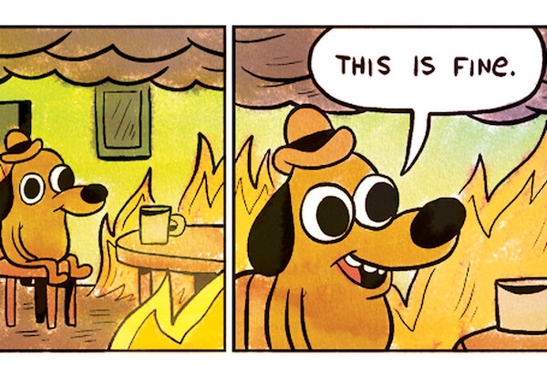

import Caption from "../components/Caption";
import ScrollToTopButton from "../components/ScrollToTopButton";

<ScrollToTopButton />

It seems inevitable for me to fall into some browser compatibility trap from time to time. <a href="https://goodguydaniel.com/blog/browser-polyfill-madness-mozilla-internet-explorer/" target="_blank" title="goodguydaniel.com, Browser polyfill madness, Mozilla and IE">The last _"blogpost worthy"_ one that I faced was fun</a>, but still, it was traceable through the standard browser compatibility resources such as <a href="https://caniuse.com/" target="_blank" title="Can I use... Support tables for HTML5, CSS3, etc">caniuse.com</a> or <a href="https://developer.mozilla.org/en-US/" target="_blank" title="MDN Web Docs">MDN Web Docs</a> browser compatibility tables.

Well, this time, <a href="https://developer.mozilla.org/en-US/docs/Web/API/MutationObserverInit/attributeFilter" target="_blank" title="MutationObserverInit, attributeFilter on MDN Web APIs">MutationObserverInit.attributeFilter</a> gave me a bit of a hard time.

<Caption source="https://twitter.com/GOP/status/757687865471963137" />

While working in some implementation that requires me to detect when a DOM element is mutated, I did not blink an eye when it came to choosing the <a href="https://developer.mozilla.org/en-US/docs/Web/API/MutationObserver" target="_blank" title="MutationObserver on MDN Web APIs">MutationObserver API</a> to get the job done. But this time, I used something different, that was <a href="https://developer.mozilla.org/en-US/docs/Web/API/MutationObserverInit/attributeFilter" target="_blank" title="MutationObserverInit, attributeFilter on MDN Web APIs">MutationObserverInit.attributeFilter</a>.

The problem here is that the relevant browser compatibility information was not accurate for the usage of `attributeFilter`, especially for Internet Explorer and Edge browsers. It happens that these browsers throw a syntax error upon the usage of this API without setting a flag, I won't bother you with the details, you can now check <a href="https://caniuse.com/#search=attributeFilter" target="_blank" title="Can I use... Support tables for HTML5, CSS3, etc search for attributeFilter">caniuse.com `attributeFilter` compatibility information</a>, you might find all the details about this issue there.

The point here is that we might be reaching soon (maybe a few years more) a more stable era of browsers with the discontinuation of IE and the Microsoft Edge big move on becoming a <a href="https://www.chromium.org/Home" target="_blank" title="Chromium is an open-source browser project that aims to build a safer, faster, and more stable way for all Internet users to experience the web">Chromium-based</a> browser. **In the meantime**, we can all contribute to a compatible web. **How can we individually help?**

- You see a **browser-specific funky issue.**
- You **can't find any references for the issue online**, especially in official sources such as _caniuse_ and MDN browser compatibility tables.
- You **go to <a href="https://github.com/mdn/browser-compat-data" target="_blank" title="This repository contains compatibility data for Web technologies as displayed on MDN">mdn/browser-compat-data</a>**, and there's no open Pull Request or ongoing issue that points towards the problem you found.

If you tick all the checkboxes ✅ in the previous list, you can go ahead and open a Pull Request on <a href="https://github.com/mdn/browser-compat-data" target="_blank" title="This repository contains compatibility data for Web technologies as displayed on MDN">mdn/browser-compat-data</a>; the mdn team, me, and all the community own you a big thanks for documenting the issue. Lastly, but most importantly, you'll be ensuring that no one has to go through all the pain to debug and figure out why the hell your application was breaking.

<Caption />

I did so, <a href="https://github.com/mdn/browser-compat-data/pull/5540" target="_blank" title="Update MutationObserverInit.attributeFilter on IE11 usage known issue on Github">with the attributeFilter issue</a> on the <a href="https://developer.mozilla.org/en-US/docs/Web/API/MutationObserverInit/attributeFilter" target="_blank" title="MutationObserverInit, attributeFilter on MDN Web APIs">MutationObserverInit.attributeFilter</a> API. <a href="https://caniuse.com/#search=attributeFilter" target="_blank" title="Can I use... Support tables for HTML5, CSS3, etc search for attributeFilter">Here's the final result where _caniuse_</a> is displaying the information for users about the compatibility issue on the `attributeFilter` API.

<Caption source="https://caniuse.com/#search=attributeFilter" />

I hope this short episode makes you aware that you can help to make the web compatible and help the community get relieved of all of these annoying nuances of the different JavaScript APIs in the various browsers, especially when working with Internet Explorer and Edge.
